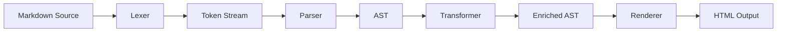

# IFM Parser Specification

Isidorica Flavored Markdown (IFM) パーサーの詳細仕様。
本ドキュメントは開発者向けであり、パーサー実装の要件定義書として機能する。

**ステータス**: 🔄 ドラフト

> **関連ドキュメント**: 執筆者向けの記法ガイドは [MARKDOWN_SPEC.md](../../library/technical/MARKDOWN_SPEC.md) を参照。

---

## 1. 概要

### 1.1 役割

IFMパーサーは、Markdown形式の記事ファイルを解析し、HTMLに変換する。

```
Markdown (.md) → IFM Parser → AST → HTML
```

### 1.2 責務

| 責務 | 説明 |
| :--- | :--- |
| **構文解析** | CommonMark + IFM拡張のパース |
| **Directive処理** | `:::` (Block), `:` (Inline) の解析と変換 |
| **リンク分類** | 内部/関連サービス/外部リンクの自動判定 |
| **数式レンダリング** | KaTeX互換の静的/動的レンダリング |
| **出典解決** | `[@id]` → bibliography.json との連携 |
| **バリデーション** | 構造ルール、出典存在チェック等 |

### 1.3 設計原則

1. **remark/rehypeは使用しない**: IFM固有の要件に最適化した独自実装
2. **段階的処理**: Lexer → Parser → Transformer → Renderer の明確な分離
3. **エラー回復**: パースエラー発生時も可能な限り処理を継続

---

## 2. パースパイプライン



### 2.1 Lexer

Markdownソースをトークン列に分解する。

| トークン種別 | 例 |
| :--- | :--- |
| `HEADING` | `## 見出し` |
| `PARAGRAPH` | 通常のテキスト |
| `DIRECTIVE_OPEN` | `:::note` |
| `DIRECTIVE_CLOSE` | `:::` |
| `INLINE_DIRECTIVE` | `:kbd:[Enter]` |
| `MATH_INLINE` | `$E=mc^2$` |
| `MATH_BLOCK` | `$$...$$` |
| `CITATION` | `[@id, p.XX]` |

### 2.2 Parser

トークン列をAST（抽象構文木）に変換する。

```typescript
// AST Node例
interface DirectiveNode {
  type: 'directive';
  name: string;       // 'note', 'figure', 'laboratory' etc.
  attributes: Record<string, string>;
  children: Node[];
}
```

### 2.3 Transformer

ASTを加工し、追加情報を付与する。

| 処理 | 説明 |
| :--- | :--- |
| リンク分類 | URLを解析し `linkType` 属性を付与 |
| 出典解決 | `[@id]` を bibliography.json と照合 |
| 見出しID生成 | `## Heading` → `id="heading"` |
| 目次生成 | 見出しノードから目次構造を抽出 |

### 2.4 Renderer

ASTをHTMLに変換する。

---

## 3. Directive処理

### 3.1 Block Directive (`:::`)

```
::: {name} {attributes}
{content}
:::
```

| 要素 | 必須 | 説明 |
| :--- | :--- | :--- |
| `name` | Yes | Directive名（`note`, `figure`, `laboratory` 等） |
| `attributes` | No | 属性（`{key="value" ...}`） |
| `content` | Depends | Directiveによる |

#### パース規則

1. `:::` で始まる行を検出
2. 直後の単語をDirective名として取得
3. `{...}` があれば属性としてパース
4. 次の `:::` までをcontentとして取得（ネスト対応）

### 3.2 Inline Directive (`:`)

```
:name:[content]
```

| 例 | 出力 |
| :--- | :--- |
| `:kbd:[Enter]` | `<kbd>Enter</kbd>` |
| `:icon:[settings]` | `<span class="icon icon-settings"></span>` |
| `:ref:[eq:gauss-sum]` | `<a href="#eq:gauss-sum">式 (1)</a>` |

### 3.3 Tabs Directive (`:::tab-group`)

汎用タブ切り替えコンポーネントの処理。

#### 3.3.1 AST構造

```typescript
interface TabGroupNode {
  type: 'tabGroup';
  attributes: {
    syncKey?: string;  // 同期用キー（optional）
  };
  children: TabNode[];
}

interface TabNode {
  type: 'tab';
  title: string;
  children: Node[];
}
```

#### 3.3.2 パース処理

1. `::: tab-group` を検出
2. 子Directive `::: tab {title="..."}` を検出し、タイトルを抽出
3. 各タブの内容を再帰的にパース

#### 3.3.3 HTML変換

```html
<div class="tabs" data-sync-key="optional-key">
  <div class="tabs-header" role="tablist">
    <button role="tab" aria-selected="true" aria-controls="panel-1" id="tab-1">
      Title A
    </button>
    <!-- ... -->
  </div>
  <div class="tab-panel" id="panel-1" role="tabpanel" aria-labelledby="tab-1">
    <!-- Content A -->
  </div>
  <!-- ... -->
</div>
```

### 3.4 Steps Directive (`:::steps`)

タイムライン形式のステップコンポーネントの処理。

#### 3.4.1 AST構造

```typescript
interface StepsNode {
  type: 'steps';
  children: StepItemNode[];
}

interface StepItemNode {
  type: 'stepItem';
  title: string;
  children: Node[];
}
```

#### 3.4.2 パース処理

1. `::: steps` ブロックを検出
2. 内部の**順序付きリスト (`1.`)**を解析
3. リストアイテムの**最初の行**にある`**太字テキスト**`をタイトルとして抽出
4. 残りをコンテンツとして抽出

#### 3.4.3 HTML変換

```html
<div class="steps">
  <ol>
    <li class="step-item">
      <h3 class="step-title">
        <span class="step-marker">1</span>
        Title
      </h3>
      <div class="step-content">
        <!-- コンテンツ -->
      </div>
    </li>
  </ol>
</div>
```

### 3.5 Variables処理

Frontmatterで定義された変数を本文内で展開する。

#### 3.5.1 処理フロー

```
1. Frontmatter から variables を抽出
2. 本文中の {{変数名}} パターンを検出
3. 変数値で置換
```

#### 3.5.2 実装

```typescript
function expandVariables(content: string, frontmatter: Frontmatter): string {
  const variables = {
    ...frontmatter.variables,
    slug: frontmatter.slug,
    title: frontmatter.title,
  };
  return content.replace(/\{\{([^}]+)\}\}/g, (_, key) => variables[key.trim()] || '');
}
```

### 3.6 Inline Directive処理

`:name:[content]` 形式のInline Directiveを処理する。

#### 3.6.1 パターン

```typescript
const INLINE_DIRECTIVE_PATTERN = /:(\w+):\[([^\]]+)\]/g;
```

#### 3.6.2 処理マップ

```typescript
const inlineDirectiveHandlers: Record<string, (content: string) => string> = {
  kbd: (content) => `<kbd>${escapeHtml(content)}</kbd>`,
  
  icon: (content) => `<span class="icon icon-${content}" aria-hidden="true"></span>`,
  
  ref: (content) => {
    const [prefix, id] = content.includes(':') 
      ? content.split(':') 
      : ['', content];
    
    const labels: Record<string, string> = {
      eq: '式',
      fig: '図',
      table: '表',
    };
    
    const label = labels[prefix] || '';
    const number = getReferenceNumber(content);  // 参照番号を取得
    
    // ラベルと番号を自動生成（執筆者は :ref:[eq:gauss-sum] のみ記述）
    return `<a href="#${content}">${label} ${number}</a>`;
  },
};
```

#### 3.6.3 HTML出力

| Directive | 入力 | 出力 |
| :--- | :--- | :--- |
| `:kbd:` | `:kbd:[Ctrl]` | `<kbd>Ctrl</kbd>` |
| `:icon:` | `:icon:[settings]` | `<span class="icon icon-settings" aria-hidden="true"></span>` |
| `:ref:` | `:ref:[eq:gauss-sum]` | `<a href="#eq:gauss-sum">式 (1)</a>` |

#### 3.6.4 参照番号の自動採番

図・表・数式の番号は自動採番される。執筆者は番号を記述しない。

**処理フロー**:
```
1. パース時に fig:, table:, eq: プレフィックスを持つIDを収集
2. 出現順に番号を割り当て
3. ReferenceRegistry に登録
4. :ref: 参照時にレジストリから番号を取得
5. HTML生成時にキャプションに番号を挿入
```

**実装**:
```typescript
interface ReferenceRegistry {
  equations: Map<string, number>;   // id -> 番号
  figures: Map<string, number>;
  tables: Map<string, number>;
}

function buildReferenceRegistry(nodes: Node[]): ReferenceRegistry {
  const registry: ReferenceRegistry = {
    equations: new Map(),
    figures: new Map(),
    tables: new Map(),
  };
  
  let eqCounter = 1;
  let figCounter = 1;
  let tableCounter = 1;
  
  // ASTを走査して番号を割り当て
  walkNodes(nodes, (node) => {
    if (node.type === 'math' && node.id?.startsWith('eq:')) {
      registry.equations.set(node.id, eqCounter++);
    }
    if (node.type === 'figure' && node.id?.startsWith('fig:')) {
      registry.figures.set(node.id, figCounter++);
    }
    if (node.type === 'table' && node.id?.startsWith('table:')) {
      registry.tables.set(node.id, tableCounter++);
    }
  });
  
  return registry;
}

function getReferenceNumber(id: string, registry: ReferenceRegistry): string {
  const [prefix] = id.split(':');
  
  switch (prefix) {
    case 'eq':
      return `(${registry.equations.get(id) || '?'})`;
    case 'fig':
      return `${registry.figures.get(id) || '?'}`;
    case 'table':
      return `${registry.tables.get(id) || '?'}`;
    default:
      return '?';
  }
}
```

**HTML生成例（図）**:
```typescript
function generateFigureHtml(node: FigureNode, registry: ReferenceRegistry): string {
  const number = registry.figures.get(node.id) || '?';
  return `
    <figure id="${node.id}">
      
      <figcaption>
        <span class="figure-number">図 ${number}:</span> ${node.caption}
      </figcaption>
    </figure>
  `;
}
```

#### 3.6.5 バリデーション

| チェック | 重大度 | 説明 |
| :--- | :--- | :--- |
| **参照先不存在** | Warning | `:ref:[eq:xxx]` の参照先IDが見つからない |
| **重複ID** | Error | 同じIDが複数の要素に付与されている |
| **未使用ID** | Info | IDが定義されているが参照されていない |

```typescript
function validateReferences(
  references: Set<string>,  // :ref: で参照されたID
  definitions: Set<string>  // 実際に定義されたID
): ValidationResult[] {
  const results: ValidationResult[] = [];
  
  // 参照先が存在しない
  for (const ref of references) {
    if (!definitions.has(ref)) {
      results.push({
        type: 'warning',
        message: `Reference target not found: ${ref}`,
        code: 'REF_NOT_FOUND',
      });
    }
  }
  
  // 未使用ID（Info）
  for (const def of definitions) {
    if (!references.has(def)) {
      results.push({
        type: 'info',
        message: `Defined but not referenced: ${def}`,
        code: 'REF_UNUSED',
      });
    }
  }
  
  return results;
}
```

---

## 4. リンク処理

### 4.1 リンク種別の自動分類

執筆者は標準の `[text](url)` 記法を使用し、パーサーがURLを解析して種別を判定する。

| 種別 | 判定ルール | UI表現 |
| :--- | :--- | :--- |
| **internal** | 相対パス、`isidorica.org` 配下 | 通常リンク |
| **related** | `github.com/isidorica/*`, `assets.isidorica.org` | サービスアイコン付き |
| **external** | 上記以外 | 外部リンクアイコン（↗） |

### 4.2 判定ロジック

```typescript
function classifyLink(url: string): 'internal' | 'related' | 'external' {
  const internalPatterns = [
    /^\/[a-z][a-z0-9-]*$/,           // 記事スラグ（絶対パス）
    /^\.\/.*$/,                       // 相対パス
    /^#/,                             // ページ内アンカー
    /^https?:\/\/(www\.)?isidorica\.org(\/|$)/,
  ];
  
  const relatedPatterns = [
    /^https?:\/\/github\.com\/isidorica\//,
    /^https?:\/\/assets\.isidorica\.org\//,
  ];
  
  if (internalPatterns.some(p => p.test(url))) return 'internal';
  if (relatedPatterns.some(p => p.test(url))) return 'related';
  return 'external';
}
```

### 4.3 外部リンクの属性付与

外部リンクには以下の属性を自動付与する。

```html
<a href="https://example.com" target="_blank" rel="noopener noreferrer">
  Example <span class="external-link-icon" aria-hidden="true">↗</span>
</a>
```

### 4.4 見出し処理（Heading Processing）

#### 4.4.1 見出しID生成

各見出しに一意のIDを自動生成する。

| ルール | 説明 |
| :--- | :--- |
| **英語見出し** | 小文字化、スペースをハイフンに変換（`Nash Equilibrium` → `nash-equilibrium`） |
| **日本語見出し** | 簡易ローマ字変換 or ハッシュ化（`ナッシュ均衡` → `nasshu-kinkou` or `h3a2b1c`） |
| **カスタムID優先** | `## Heading {#custom-id}` が指定されていればそれを使用 |
| **重複回避** | 同一IDが存在する場合は連番を付与（`nash-equilibrium-2`） |

#### 4.4.2 Autolink Headings

すべての見出し（H2〜H6）にアンカーリンクを自動付与する。

**HTML出力**:
```html
<h2 id="nash-equilibrium">
  <a href="#nash-equilibrium" class="heading-anchor" aria-hidden="true">
    <span class="heading-anchor-icon">#</span>
  </a>
  ナッシュ均衡
</h2>
```

#### 4.4.3 アクセシビリティ

| 要素 | 対応 |
| :--- | :--- |
| **アンカーリンク** | `aria-hidden="true"`（スクリーンリーダーでは読み上げない） |
| **キーボード操作** | フォーカス可能（Tab順序に含める） |
| **ホバー表示** | CSSで `:hover` 時にのみアイコン表示（視覚的ノイズ軽減） |

#### 4.4.4 目次生成

見出しノードから目次（Table of Contents）構造を抽出する。

```typescript
interface TocItem {
  id: string;
  text: string;
  level: number;  // 2-6
  children: TocItem[];
}
```

### 4.5 インライン・グロッサリー処理（Inline Glossary）

`[[Term]]` 形式のリンクを解析し、`terms.yml` に基づいてToggletipを展開する。

#### 4.5.1 処理フロー

```
1. `terms.yml` をロード（Libraryリポジトリ: `data/terms.yml`）
2. 本文中の `[[Term|Display||Context]]` パターンを検出
3. ToggletipコンポーネントのHTMLに変換
```

#### 4.5.2 パースロジック

```typescript
const GLOSSARY_PATTERN = /\[\[([^\]|]+)(?:\|([^\]|]*))?(?:\|\|([^\]]*))?(?:\|([^\]]*))?\]\]/g;
// Groups: 1=Term, 2=DisplayText, 3=Definition(Override), 4=Intuition(Override)
```

### 4.6 略語処理（Abbreviation Processing）

記事の `topics` に基づき、`abbreviations.yml` から略語を自動展開する。

#### 4.6.1 処理フロー

```
1. Frontmatter から topics を取得
2. ローカル定義 (*[...]: ...) を収集
3. 本文中の略語パターン（全大文字2-6文字）を検出
4. 各略語について：
   ├─ ローカル定義あり → ローカル定義を使用
   ├─ abbreviations.yml に存在 → スコープ判定
   │   ├─ スコープ一致（単一） → 展開
   │   ├─ スコープ一致（複数） → 曖昧性エラー
   │   └─ スコープ一致なし → 展開しない（Warning）
   └─ abbreviations.yml に存在しない → 展開しない（Info）
```

#### 4.6.2 判定ロジック

```typescript
interface AbbrDefinition {
  full: string;
  scope: string[];
}

interface AbbreviationEntry {
  full?: string;           // 単一定義
  scope?: string[];        // 単一定義のスコープ
  definitions?: AbbrDefinition[];  // 複数定義
}

function resolveAbbreviation(
  abbr: string,
  articleTopics: string[],
  localDefs: Map<string, string>,
  abbreviations: Record<string, AbbreviationEntry>
): { full: string } | { error: string } | null {
  // 1. ローカル定義優先
  if (localDefs.has(abbr)) {
    return { full: localDefs.get(abbr)! };
  }

  // 2. abbreviations.yml から取得
  const entry = abbreviations[abbr];
  if (!entry) {
    return null;  // 存在しない → 変換しない
  }

  // 単一定義の場合
  if (entry.full) {
    const scopeMatch = entry.scope?.some(s => articleTopics.includes(s));
    if (scopeMatch || !entry.scope) {
      return { full: entry.full };
    }
    return null;  // スコープ不一致
  }

  // 複数定義の場合
  const matchingDefs = entry.definitions?.filter(def =>
    def.scope.some(s => articleTopics.includes(s))
  ) || [];

  if (matchingDefs.length === 0) {
    return null;  // スコープ一致なし
  }

  if (matchingDefs.length > 1) {
    return { error: `曖昧性エラー: "${abbr}" に複数の一致するスコープがあります` };
  }

  return { full: matchingDefs[0].full };
}
```

#### 4.5.3 HTML変換

```typescript
// 入力
"APIを使ってDOMを操作します。"

// 出力
'<abbr title="Application Programming Interface">API</abbr>を使って' +
'<abbr title="Document Object Model">DOM</abbr>を操作します。'
```

#### 4.5.4 CIバリデーション

| チェック | 重大度 | 説明 |
| :--- | :--- | :--- |
| **未定義略語** | Info | glossary.yml に存在しない略語 |
| **スコープ不一致** | Warning | 存在するが topics と一致しない |
| **曖昧性エラー** | Error | 複数スコープ一致（ローカル定義で解決が必要） |
| **ローカル vs グローバル不一致** | Info | 意図的な上書きの可能性 |

### 4.6 ルビ処理（Ruby Processing）

ビルド時に形態素解析を使用し、漢字に自動でルビを付与する。

#### 4.6.1 処理フロー

```
1. 明示的ルビ記法 {漢字|よみ} を検出・抽出
2. 残りのテキストを Sudachi で形態素解析
3. 各トークンについて:
   ├─ 漢字を含む → ルビ付与
   │   ├─ レベル判定（basic/joyo/non-joyo）
   │   └─ HTML生成
   └─ 漢字なし → そのまま出力
4. 明示的指定を優先して最終HTML生成
```

#### 4.6.2 Sudachi設定

```typescript
import { Tokenizer, SplitMode } from 'sudachi-wasm';

const tokenizer = await Tokenizer.create();

function tokenize(text: string) {
  // SplitMode.C: 長い単位（熟語を1語として扱う）
  return tokenizer.tokenize(text, SplitMode.C);
}
```

#### 4.6.3 漢字レベル判定

漢字辞書（`kanji-levels.json`）を使用してレベルを判定する。

```json
{
  "山": "basic",
  "川": "basic",
  "歴": "basic",
  "彙": "joyo",
  "謂": "joyo",
  "齟": "non-joyo",
  "齬": "non-joyo"
}
```

```typescript
function getKanjiLevel(word: string, dict: Record<string, string>): 'basic' | 'joyo' | 'non-joyo' {
  let maxLevel: 'basic' | 'joyo' | 'non-joyo' = 'basic';
  
  for (const char of word) {
    if (isKanji(char)) {
      const level = dict[char] || 'non-joyo';
      if (level === 'non-joyo') return 'non-joyo';
      if (level === 'joyo' && maxLevel === 'basic') maxLevel = 'joyo';
    }
  }
  
  return maxLevel;
}
```

#### 4.6.4 HTML生成

```typescript
function generateRubyHtml(surface: string, reading: string, level: string): string {
  return `<ruby data-level="${level}">${surface}<rp>（</rp><rt>${reading}</rt><rp>）</rp></ruby>`;
}
```

**出力例**:
```html
<ruby data-level="basic">歴史<rp>（</rp><rt>れきし</rt><rp>）</rp></ruby>
<ruby data-level="joyo">所謂<rp>（</rp><rt>いわゆる</rt><rp>）</rp></ruby>
<ruby data-level="non-joyo">齟齬<rp>（</rp><rt>そご</rt><rp>）</rp></ruby>
```

#### 4.6.5 クライアントサイド動的制御

ユーザー設定に応じてルビの表示/非表示を切り替える。

```typescript
type RubySetting = 'all' | 'beyond-basic' | 'non-joyo' | 'none';

function updateRubyVisibility(setting: RubySetting) {
  document.querySelectorAll('ruby').forEach(ruby => {
    const level = ruby.dataset.level;
    const rt = ruby.querySelector('rt');
    const rps = ruby.querySelectorAll('rp');
    
    let show = false;
    switch (setting) {
      case 'all': show = true; break;
      case 'beyond-basic': show = level !== 'basic'; break;
      case 'non-joyo': show = level === 'non-joyo'; break;
      case 'none': show = false; break;
    }
    
    rt?.classList.toggle('sr-only', !show);
    rps.forEach(rp => rp.classList.toggle('sr-only', !show));
  });
}
```

**CSS**:
```css
ruby rt.sr-only,
ruby rp.sr-only {
  position: absolute;
  width: 1px;
  height: 1px;
  overflow: hidden;
  clip: rect(0, 0, 0, 0);
}
```

> **アクセシビリティ**: `display: none` ではなく `sr-only` を使用し、スクリーンリーダーでは読み上げられるようにする。

### 4.7 コードブロック処理（Code Block Processing）

フェンスコードブロックの拡張属性をパースし、HTMLに変換する。

#### 4.7.1 属性パース

````markdown
```python showLineNumbers title="sort.py" {3,5-7} +{10} -{9}
````

```typescript
interface CodeBlockMeta {
  language: string;
  showLineNumbers: boolean;
  title?: string;
  highlight: number[];      // ハイライト行
  additions: number[];      // 追加行（Diff）
  deletions: number[];      // 削除行（Diff）
  noCollapse: boolean;
}

function parseCodeBlockMeta(meta: string): CodeBlockMeta {
  const language = meta.split(' ')[0];
  const showLineNumbers = meta.includes('showLineNumbers');
  const title = meta.match(/title="([^"]+)"/)?.[1];
  const highlight = parseLineNumbers(meta.match(/\{([^}]+)\}/)?.[1]);
  const additions = parseLineNumbers(meta.match(/\+\{([^}]+)\}/)?.[1]);
  const deletions = parseLineNumbers(meta.match(/-\{([^}]+)\}/)?.[1]);
  const noCollapse = meta.includes('noCollapse');
  
  return { language, showLineNumbers, title, highlight, additions, deletions, noCollapse };
}

function parseLineNumbers(spec: string | undefined): number[] {
  if (!spec) return [];
  const lines: number[] = [];
  for (const part of spec.split(',')) {
    if (part.includes('-')) {
      const [start, end] = part.split('-').map(Number);
      for (let i = start; i <= end; i++) lines.push(i);
    } else {
      lines.push(Number(part));
    }
  }
  return lines;
}
```

#### 4.7.2 自動折りたたみ

| 条件 | 動作 |
| :--- | :--- |
| 行数 ≥ 25 かつ `noCollapse` なし | 最初の15行を表示、残りを折りたたみ |
| `noCollapse` あり | 折りたたみなし |

#### 4.7.3 領域マーカー処理

```typescript
interface CodeRegion {
  name: string;
  startLine: number;
  endLine: number;
}

function parseRegions(code: string): { regions: CodeRegion[], hasNonRegionLines: boolean } {
  const lines = code.split('\n');
  const regions: CodeRegion[] = [];
  let currentRegion: Partial<CodeRegion> | null = null;
  let nonRegionLineCount = 0;
  
  lines.forEach((line, index) => {
    const startMatch = line.match(/#\s*@region\s+(\w+)/);
    const endMatch = line.match(/#\s*@endregion/);
    
    if (startMatch) {
      currentRegion = { name: startMatch[1], startLine: index + 1 };
    } else if (endMatch && currentRegion) {
      regions.push({ ...currentRegion, endLine: index + 1 } as CodeRegion);
      currentRegion = null;
    } else if (!currentRegion) {
      nonRegionLineCount++;
    }
  });
  
  return { regions, hasNonRegionLines: nonRegionLineCount > 0 };
}
```

**バリデーション**:

| チェック | 対応 |
| :--- | :--- |
| 全行が領域内 | 領域マーカーを無効化 + CI警告 |
| ネストされた @region | 内側を無視 + CI警告 |
| 閉じられていない @region | CIがファイル末尾に `@endregion` を自動追記 + 追記した旨を報告 |

#### 4.7.4 パッケージマネージャータブ

`npm` 言語識別子のコードブロックを変換する。

```typescript
function transformNpmCommand(cmd: string): Record<string, string> {
  const transforms: Record<string, (cmd: string) => string> = {
    npm: (cmd) => cmd,
    yarn: (cmd) => cmd
      .replace(/^npm install/, 'yarn add')
      .replace(/^npm run (\w+)/, 'yarn $1'),
    pnpm: (cmd) => cmd
      .replace(/^npm install/, 'pnpm add')
      .replace(/^npm run (\w+)/, 'pnpm $1'),
    bun: (cmd) => cmd
      .replace(/^npm install/, 'bun add')
      .replace(/^npm run (\w+)/, 'bun $1'),
  };
  
  return {
    npm: transforms.npm(cmd),
    yarn: transforms.yarn(cmd),
    pnpm: transforms.pnpm(cmd),
    bun: transforms.bun(cmd),
  };
}
```

#### 4.7.5 HTML出力

```html
<div class="code-block" data-language="python">
  <div class="code-block-header">
    <span class="code-block-title">sort.py</span>
    <button class="code-block-copy" aria-label="コードをコピー">コピー</button>
  </div>
  <pre><code class="language-python">
    <span class="line" data-line="1">def quick_sort(arr):</span>
    <span class="line highlight" data-line="2">    if len(arr) <= 1:</span>
    <span class="line addition" data-line="3">        return arr</span>
    <span class="line deletion" data-line="4">        # old code</span>
  </code></pre>
</div>
```

---

## 5. 数式処理

### 5.1 レンダリング方式

| 方式 | 条件 | 処理タイミング |
| :--- | :--- | :--- |
| **静的** | 記事本文の数式 | ビルド時（SSG） |
| **動的** | Laboratory内の数式 | クライアントサイド |

### 5.2 静的レンダリング

ビルド時にKaTeX互換エンジンでHTMLを生成する。

```markdown
$E = mc^2$
```

```html
<span class="math-inline">
  <span class="katex">...</span>
  <math>...</math> <!-- MathML for a11y -->
</span>
```

### 5.3 動的レンダリング

Laboratory内の数式は、パラメータ変更に応じてクライアントサイドで再レンダリングする。

---

## 6. 出典処理

### 6.1 インライン出典のパース

```markdown
ゲーム理論は確立された [@neumann-1944, p. 45]。
```

| 要素 | 説明 |
| :--- | :--- |
| `@neumann-1944` | 出典ID（bibliography.jsonのキー） |
| `p. 45` | ページ番号（オプション） |

### 6.2 bibliography.jsonとの連携

```json
{
  "neumann-1944": {
    "type": "book",
    "title": "Theory of Games and Economic Behavior",
    "author": [
      {"family": "von Neumann", "given": "John"},
      {"family": "Morgenstern", "given": "Oskar"}
    ],
    "issued": {"date-parts": [[1944]]},
    "publisher": "Princeton University Press"
  }
}
```

### 6.3 出典解決エラー

存在しない出典IDを参照した場合：

- **ビルド時**: エラーとして報告（ビルド失敗）
- **エラーメッセージ**: `Citation not found: @unknown-id in article 'game-theory.md' line 42`

---

## 7. バリデーション

### 7.1 構造ルール

| ルール | 重大度 | 説明 |
| :--- | :--- | :--- |
| 見出し階層スキップ禁止 | Error | H2 → H4 のようなスキップ |
| 見出し直下に導入文必須 | Warning | 見出しの直後に別の見出し |
| Phase 4にQuiz必須 | Warning | Learner向け記事のみ |

### 7.2 出典ルール

| ルール | 重大度 | 説明 |
| :--- | :--- | :--- |
| 出典ID存在チェック | Error | `[@id]` がbibliography.jsonに存在するか |
| 外部画像に出典必須 | Error | `./images/external/` 配下の画像 |

### 7.3 アクセシビリティルール

| ルール | 重大度 | 説明 |
| :--- | :--- | :--- |
| 画像にalt必須 | Error | `` は禁止、`` 必須 |
| figure directiveにalt必須 | Error | `alt` 属性の存在チェック |

---

## 8. エラーハンドリング

### 8.1 エラー分類

| 分類 | 処理 | 例 |
| :--- | :--- | :--- |
| **Fatal** | ビルド失敗 | Frontmatter構文エラー |
| **Error** | ビルド失敗 | 出典ID未存在 |
| **Warning** | ビルド成功（警告表示） | 見出し直下に導入文なし |
| **Info** | ログ出力のみ | 未使用の出典ID |

### 8.2 エラーメッセージ形式

```
[ERROR] game-theory.md:42:15 - Citation not found: @unknown-id
[WARNING] game-theory.md:100 - Heading without introductory text
```

---

## 9. 関連ドキュメント

| ドキュメント | 関連箇所 |
| :--- | :--- |
| [MARKDOWN_SPEC.md](../../library/technical/MARKDOWN_SPEC.md) | 執筆者向け記法ガイド |
| [ARCHITECTURE_DECISION_RECORD.md](./ARCHITECTURE_DECISION_RECORD.md) | パーサー独自実装の決定根拠 |
| [NON_FUNCTIONAL_REQUIREMENTS.md](../NON_FUNCTIONAL_REQUIREMENTS.md) | パフォーマンス要件 |
