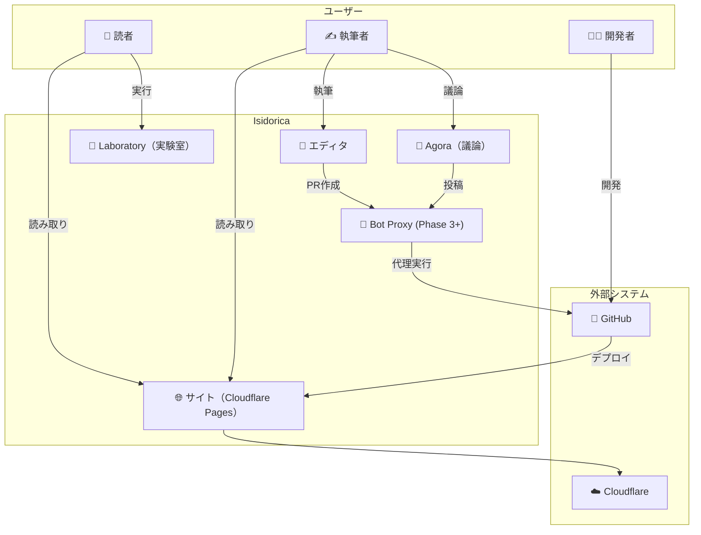
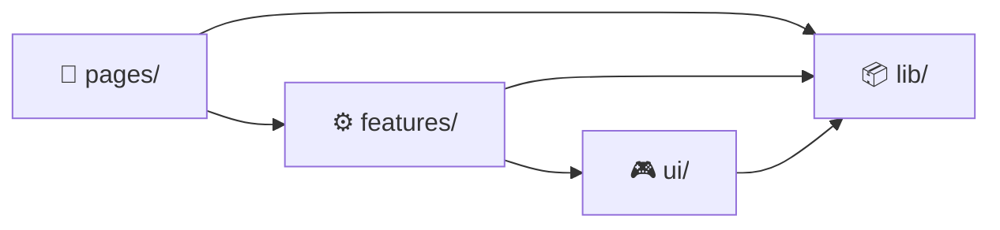
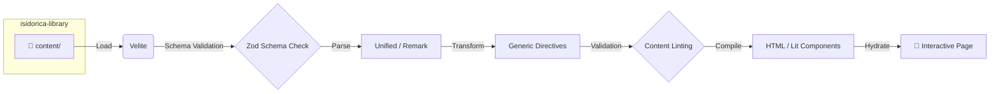
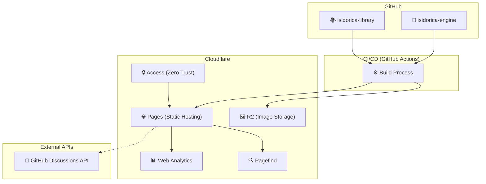
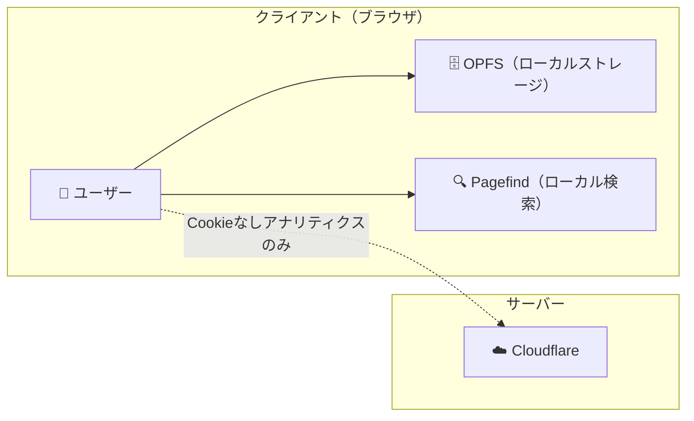
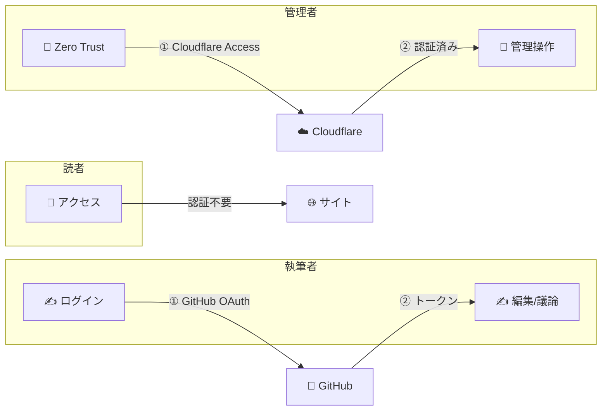

# システムアーキテクチャ定義 (System Architecture Definition)

Isidoricaプロジェクトのソフトウェアアーキテクチャ、リポジトリ戦略、およびデータフローの定義。
本ドキュメントは、技術選定書（ADR）に基づき、具体的な実装構造を規定する。

---

## 1. システムコンテキスト (System Context)

Isidoricaと外部アクター・システムの関係。

### 1.1 コンテキスト図



### 1.2 アクター定義

| アクター | 役割 | インタラクション | 認証 |
| :--- | :--- | :--- | :--- |
| **読者** | 記事を読む、Laboratoryで実験 | ブラウザ経由 | 不要 |
| **執筆者** | 記事を執筆・PR作成 | ブラウザ、GitHub経由 | GitHub OAuth (Phase 1-2) → 不要 (Phase 3+) |
| **開発者** | UI・機能開発 | GitHub経由 | GitHub OAuth |
| **管理者** | システム管理、モデレーション | 管理画面経由 | Cloudflare Access |

### 1.3 外部制約

| システム | 制約 | 影響 |
| :--- | :--- | :--- |
| **Cloudflare Pages** | ビルド500回/月（無料枚） | CI/CD頻度の考慮 |
| **Cloudflare R2** | 10GB/月（無料枚） | 画像サイズ最適化必須 |
| **GitHub API** | 5000リクエスト/時（認証済み） | Agoraのキャッシュ戦略必須 |
| **GitHub Discussions** | Rate Limitあり | SWRパターンで対応 |

---

## 2. リポジトリ戦略 (Repository Strategy)

システムの「器（Engine）」と「中身（Library）」を物理的に分離し、それぞれのライフサイクルとコントリビュータ（開発者 vs 執筆者）の違いに対応する。

### 2.1 構成
| Repository | Role | Technology | Contents |
| :--- | :--- | :--- | :--- |
| **`isidorica-engine`** | **System (Application)** | Astro, Lit, TS | ビルドロジック、UIコンポーネント、スタイル定義 |
| **`isidorica-library`** | **Content (Database)** | Markdown, Images | 記事ファイル、画像アセット、用語集 (`prh.yml`) |

### 2.2 統合方法 (Integration)

Engine と Library は**完全に独立したリポジトリ**として管理し、**CI/CD でのみ統合**する。

#### 設計理由

| 理由 | 説明 |
| :--- | :--- |
| **役割の分離** | 執筆者は Engine リポジトリを扱う必要がない。開発者は Library リポジトリを扱う必要がない |
| **クローンの軽量化** | 執筆者は Library のみクローン。Engine の依存関係をインストールする必要がない |
| **サブモジュールの複雑さ回避** | `git submodule` の操作ミスによるトラブルを防止 |
| **独立したライフサイクル** | Engine のバージョンアップと Library のコンテンツ更新を完全に独立して行える |

#### コントリビューターの役割

| 役割 | 対象リポジトリ | 作業内容 |
| :--- | :--- | :--- |
| **執筆者** | `isidorica-library` のみ | 記事の執筆・編集、画像の追加 |
| **開発者** | `isidorica-engine` のみ | UI開発、プラグイン開発、ビルド設定 |
| **フルスタック** | 両方 | 両方を扱う場合は別々にクローン |

#### 統合ポイント

*   **ビルド時 (CI/CD)**:
    *   デプロイサーバー上で Engine と Library の両方をクローンし、Library を Engine の `content/` ディレクトリに配置してからビルドを実行する。
    *   具体的には、GitHub Actions / Cloudflare Pages のビルドステップで Library を取得する。

```yaml
# .github/workflows/deploy.yml（概要）
- name: Checkout Engine
  uses: actions/checkout@v4
  
- name: Checkout Library
  uses: actions/checkout@v4
  with:
    repository: isidorica/isidorica-library
    path: content
    
- name: Build
  run: npm run build
```

*   **Webhookによる自動デプロイ**:
    *   Library リポジトリの `main` ブランチへのプッシュをトリガーとして、Engine リポジトリのビルドを実行する。
    *   これにより、コンテンツ更新が即座にサイトに反映される。

#### ローカルでのプレビュー（執筆者向け）

執筆者が Engine を使わずに記事をプレビューする方法:

| 方法 | 説明 |
| :--- | :--- |
| **Markdown プレビュー** | VSCode 等のエディタ内蔵プレビューで基本的な確認 |
| **PR プレビュー** | PR 作成時に自動でプレビュー環境を構築（Cloudflare Pages Preview） |

#### ローカルでの統合開発（開発者向け）

Engine 開発者がコンテンツを含めた動作確認を行いたい場合:

```bash
# Engine をクローン
git clone https://github.com/isidorica/isidorica-engine.git
cd isidorica-engine

# Library を別途クローンして content/ に配置
git clone https://github.com/isidorica/isidorica-library.git content

# 開発サーバー起動
pnpm install
pnpm run dev
```

*   `content/` は `.gitignore` に追加されており、Engine リポジトリには含まれない。
*   これにより、開発者は必要に応じて Library を取得できるが、必須ではない。

### 1.3 将来のスケーリング戦略 (Scaling Strategy)

Isidoricaは長期的な成長を見据え、記事数増加やコントリビューター増加に伴うリポジトリ分離に対応できるアーキテクチャを採用している。本セクションでは、現在のアーキテクチャがなぜ将来の分離に耐えうるのか、そしてどのタイミングで分離を検討すべきかを定義する。

#### 1.3.1 スケーリング時に発生する課題

単一リポジトリでコンテンツを管理し続けた場合、以下の課題が顕在化する。

| 課題 | 具体的な影響 | 発生時期の目安 |
| :--- | :--- | :--- |
| **リポジトリサイズ増大** | `git clone` に数分〜数十分かかるようになる。新規コントリビューターの参入障壁が上がる | 記事500〜1000 |
| **CI/CD時間の増加** | 全記事のビルド・検証に時間がかかり、PRのフィードバックループが遅くなる | 記事500〜 |
| **コントリビューター間の競合** | 1つの記事を編集するだけでも全リポジトリをクローンする必要がある。異なる言語・分野を担当するチーム間で不要な依存が生じる | 多言語展開時 |
| **マージコンフリクトの頻発** | 設定ファイル（`concept-relations.yml` 等）や共有リソースで複数PRが衝突する | コントリビューター10人〜 |

#### 1.3.2 スケーリングフェーズ

成長段階に応じて、段階的にアーキテクチャを進化させる。なお、すべてのフェーズにおいて**サブモジュールは使用せず、CI/CD での統合**を基本とする。

##### Phase 1: 2リポジトリ構成（現在〜大規模化前）

```
[GitHub]
├── isidorica-engine/       ← システムリポジトリ
│   ├── src/
│   ├── config/
│   │   ├── concept-relations.yml
│   │   ├── learning-paths.yml
│   │   └── disciplines.yml
│   └── ...
│
└── isidorica-library/      ← コンテンツリポジトリ
    ├── articles/
    │   ├── ja/
    │   │   ├── philosophy/
    │   │   └── technology/
    │   └── en/
    │       └── ...
    ├── data/               ← 頻繁に更新されるデータファイル
    │   ├── terms.yml       # 辞書データ
    │   ├── topics.yml      # トピック定義
    │   └── bibliography.json  # 参考文献
    └── images/

[CI/CD ビルド時]
isidorica-engine/
└── content/                ← CI/CD で isidorica-library をクローンして配置
    ├── articles/
    │   ├── ja/
    │   └── en/
    └── data/
        ├── terms.yml
        ├── topics.yml
        └── bibliography.json
```

*   **構成**: Engine と Library の2リポジトリ。**不変の設定ファイル**（`concept-relations.yml` 等）は Engine 側、**頻繁に更新されるコンテンツデータ**（`terms.yml`, `topics.yml`, `bibliography.json`）は Library 側で管理。CI/CD でビルド時に統合。
*   **判断基準**: Library の `git clone` が1分以内で完了する間は維持。
*   **メリット**: シンプルな構成、管理コスト最小。執筆者と開発者が完全に分離。設定変更とコンテンツ変更が独立。コンテンツデータ（辞書等）は記事と同じPRで更新可能。
*   **デメリット**: Library が大きくなるとクローン時間が増加。

##### Phase 2: 言語別リポジトリ分割（多言語大規模時）

```
[GitHub]
├── isidorica-engine/
│   ├── src/
│   └── config/
│       ├── concept-relations.yml       ← 全言語共通
│       ├── learning-paths.yml
│       └── disciplines.yml
│
├── isidorica-content-ja/   ← 日本語コンテンツ（独立リポジトリ）
│   ├── philosophy/
│   └── technology/
│
├── isidorica-content-en/   ← 英語コンテンツ（独立リポジトリ）
│   ├── philosophy/
│   └── technology/
│
└── isidorica-content-zh/   ← 中国語コンテンツ（将来）
    └── ...

[CI/CD ビルド時]
isidorica-engine/
└── content/
    ├── ja/                 ← isidorica-content-ja をクローン
    ├── en/                 ← isidorica-content-en をクローン
    └── zh/                 ← isidorica-content-zh をクローン
```

*   **構成**: Engine + 言語別コンテンツリポジトリ（複数）。CI/CD で全リポジトリをクローンして統合。
*   **判断基準**: 言語ごとに独立した翻訳チームが存在し、互いに影響を与えずに作業したい場合。または Library の `git clone` が1分を超える場合。
*   **メリット**: 言語チームが完全に独立して作業可能。クローンサイズを言語ごとに最小化。日本語執筆者は `isidorica-content-ja` のみクローンすればよい。
*   **デメリット**: リポジトリ数が増え、CI/CD の設定が複雑になる。

#### 1.3.3 分離適応のための設計原則

現在のアーキテクチャが将来の分離に対応可能な理由を以下に示す。

| 設計原則 | 説明 | 現在の対応状況 |
| :--- | :--- | :--- |
| **Slugのグローバル一意性** | 記事の識別子（Slug）はサイト全体で一意であるため、どのリポジトリに配置されても参照が壊れない。 | ✅ 対応済み |
| **外部ファイルでの関係管理** | 記事間の関係（`concept-relations.yml`）や学習パス（`learning-paths.yml`）はコンテンツリポジトリではなくEngine側で管理。コンテンツを分割しても関係定義は一箇所に集約される。 | ✅ 対応済み |
| **言語ベースのディレクトリ第1階層** | `content/articles/{lang}/{subject}/` という構造は、言語をディレクトリの第1階層としているため、言語単位での分割が自然にできる。 | ✅ 対応済み |
| **Slugベースの参照** | `concept-relations.yml` 等はファイルパスではなくSlugで記事を参照する。リポジトリを分割してもSlugは変わらないため、参照が壊れない。 | ✅ 対応済み |
| **CI/CD統合方式** | サブモジュールを使用せず、CI/CDで複数リポジトリをクローンして統合する方式。リポジトリ数が増えても設定追加のみで対応可能。 | ✅ 対応済み |
| **Webhookによる自動デプロイ** | 各コンテンツリポジトリの変更をトリガーとして Engine 側のビルドを実行する仕組み。 | ⬜ Phase 4で実装 |

#### 1.3.4 分離時の具体的な対策

リポジトリを分離する際に発生しうる問題と、その対策を以下に示す。

##### 記事間関係（concept-relations.yml）のクロスリポジトリ参照

**問題**: `concept-relations.yml` はEngine側にあるが、参照先の記事は別リポジトリにある。

**対策**: 
*   `concept-relations.yml` はSlugベースで記事を参照しており、ファイルパスには依存していない。
*   CI/CDでビルド時に全コンテンツリポジトリをクローン・配置してから参照解決を行うため、リポジトリの境界を意識する必要がない。

##### 翻訳連携（オリジナル更新時の通知）

**問題**: オリジナル記事（例: `ja/kant-ethics.md`）が更新されたら翻訳版（例: `en/kant-ethics.md`）に通知する必要があるが、別リポジトリだと検知が難しい。

**対策**:
*   Engine側のCI/CDがすべてのコンテンツリポジトリの変更を検知する（Webhookトリガー）。
*   オリジナル更新を検知したら、翻訳リポジトリに対してIssueを自動作成する GitHub Actions を実装。
*   詳細は [GOVERNANCE.md](../../library/GOVERNANCE.md) のセクション8.3「翻訳版への波及」を参照。

##### 参照整合性の検証（孤立記事の検出）

**問題**: リポジトリ分離後、以下のような不整合が発生しうる。
*   `learning-paths.yml` で参照されているSlugの記事が存在しない（学習パスは記事が必須）。
*   オリジナル記事が削除されたのに、翻訳版だけが残っている。

**対策**:
*   **ビルド時バリデーション**: 全コンテンツリポジトリをクローン・配置した後、以下をチェックする。
    *   `learning-paths.yml` の全Slugが実在するか → エラー（学習パスは記事が必須）
    *   翻訳版のオリジナル（`original_language` が指すSlug）が存在するか → エラー
*   **CIでの警告/エラー**: 不整合があればビルドエラーとして報告。

> **注意**: `concept-relations.yml` は概念辞書であり、記事の存在とは独立している。概念辞書内の概念に対応する記事がなくても問題ない。詳細は [NETWORK_ARCHITECTURE.md](../../library/technical/NETWORK_ARCHITECTURE.md) を参照。

##### ビルド時の統合

**問題**: 複数のコンテンツリポジトリを統合してAstroでビルドする必要がある。

**対策**:
*   Astro Content Collections は、指定したディレクトリ配下のMarkdownを自動的に収集する。
*   CI/CDでクローンしたコンテンツを `content/` ディレクトリに配置すれば、特別な設定なしに統合可能。
*   GitHub Actions でビルド前に各コンテンツリポジトリをクローンするステップを追加（セクション1.2参照）。

> **参照**: コンテンツ側のディレクトリ構造は [URL_AND_TAXONOMY_DESIGN.md](../../library/technical/URL_AND_TAXONOMY_DESIGN.md) を参照。

---

## 3. モジュール構成 (Module Organization)

`isidorica-engine` は**機能ベース（Feature-based）構成**を採用し、レイヤー分離と依存方向の制御を行う。

### 3.1 レイヤー構成

| レイヤー | 責務 | 状態管理 |
| :--- | :--- | :--- |
| **ui/** | 汎用UIコンポーネント（Button, Dialog等） | Stateless |
| **features/** | ドメイン固有の機能モジュール（Laboratory, Search, Agora, Editor） | Stateful |
| **lib/** | 共有ユーティリティ（Signals, Storage, Markdown処理） | なし |
| **layouts/** / **pages/** | Astroのレイアウトとルーティング | Astro管理 |

### 3.2 依存ルール



*   `ui/` は他のレイヤーに依存してはならない（Dumb Components）。
*   `features/` は `ui/` と `lib/` に依存できる。
*   `pages/` は全てのレイヤーを使用できる。

### 3.3 機能モジュール（features/）

| モジュール | 責務 | 主要技術 |
| :--- | :--- | :--- |
| **laboratory/** | WASMランタイム実験環境 | Pyodide, QuickJS, webR, PGlite |
| **search/** | クライアントサイド検索 | Pagefind |
| **agora/** | 議論プラットフォーム | GitHub Discussions API |
| **editor/** | コンテンツ編集 | ProseMirror + Lit |

> **詳細ディレクトリ構造**: 実際のファイル配置は `isidorica-engine/README.md` を参照。

---

## 4. データパイプライン (Data Pipeline)

MarkdownファイルがHTMLとして描画されるまでの処理フロー。



1.  **Ingest**: **Velite** を使用し、`content/` ディレクトリ配下のMarkdownを読み込む。Framework AgnosticなJSONとして出力。
2.  **Validate**: Zodスキーマにより、Frontmatter（タイトル、カテゴリ等）が正しいか厳密にチェックする。
3.  **Transform**: 自作の Unified プラグインにより、AST（抽象構文木）変換を行う。
    *   `::: note` → `<aside class="note">`
    *   `::: laboratory` → `<x-laboratory id="...">` (Web Components)
4.  **Render**: 静的HTMLとして出力し、必要な部分のみ Lit でハイドレーション（Hydration）する。

> **Framework Agnosticの意義**: VeliteはAstroに依存しないJSONを出力するため、将来的にフレームワークを変更してもデータ層は再利用可能。詳細は[ADR-006](./ARCHITECTURE_DECISION_RECORD.md)参照。

---

## 5. アーキテクチャ原則

### 5.1 原則一覧

| 原則 | 説明 | 適用例 |
| :--- | :--- | :--- |
| **Web Standards First** | フレームワーク固有の機能よりもWeb標準を優先 | Signals: Preact固有ではなくTC39標準Polyfillを採用 |
| **Logic-UI Separation** | 複雑なロジックは `src/lib/` / Controllers に分離 | Laboratory: WASMロジックはWorker、UIはLit |
| **Dependency Rule** | `ui/` は他に依存しない、`features/` は `ui/` に依存可 | ESLint import規則で強制 |
| **Content Agnostic** | Engineは特定記事に依存しない | 記事固有ロジックはDirective/Laboratoryで実装 |
| **Privacy First** | ユーザーデータはクライアントに留まる | 検索: Algolia→Pagefind（クライアント完結） |
| **Sustainability** | 外部依存を最小化、セルフホスト優先 | フォント: Google Fonts API→セルフホスト |

### 5.2 原則の優先順位

原則が衝突した場合、以下の順序で判断する。

```
Educational Equity > Privacy > Sustainability > Performance > Developer Experience
```

| 衝突例 | 判断 |
| :--- | :--- |
| パフォーマンスのためのユーザー追跡 | ❌ Privacy > Performance のため禁止 |
| DX向上のためのフレームワークロックイン | ❌ Sustainability > DX のため避ける |
| 低帯域環境のための機能省略 | ✅ Educational Equity のため許容 |

### 5.3 遵守の検証方法

| 原則 | 検証方法 |
| :--- | :--- |
| **Dependency Rule** | `eslint-plugin-import` でレイヤー間違反を検出 |
| **Privacy First** | CSP `connect-src` で許可済みAPIのみ、CIで外部リクエスト監視 |
| **Sustainability** | `pnpm audit`、Renovateによる依存脆弱性監視 |
| **Content Agnostic** | 記事Slugのハードコードをlint禁止 |

> **詳細**: 各原則の技術適用は [ARCHITECTURE_DECISION_RECORD.md](./ARCHITECTURE_DECISION_RECORD.md) 参照。

---

## 6. デプロイメントアーキテクチャ (Deployment Architecture)

Isidoricaの本番環境を構成するインフラとデータフロー。



| コンポーネント | 役割 | ADR参照 |
| :--- | :--- | :--- |
| **Cloudflare Pages** | 静的サイトホスティング、CDN配信 | ADR-008, ADR-011 |
| **Cloudflare R2** | 画像ストレージ、CDN統合 | ADR-017 |
| **Cloudflare Access** | 管理画面の認証 (Zero Trust) | ADR-005 |
| **Cloudflare Web Analytics** | アクセス解析（Cookieなし） | ADR-010 |
| **GitHub Discussions API** | Agora（議論プラットフォーム）のバックエンド | ADR-019 |

> **リスク**: Cloudflareベンダー集中については [R-TECH-09](../../shared/RISK_ANALYSIS.md) 参照。

---

## 7. セキュリティアーキテクチャ (Security Architecture)

Isidoricaのセキュリティ設計の概要。詳細は[ADR-021](./ARCHITECTURE_DECISION_RECORD.md)参照。

### 7.1 セキュリティ層

| 層 | 対策 | 説明 |
| :--- | :--- | :--- |
| **エッジ** | Cloudflare Access | 管理画面のZero Trust認証 |
| **トランスポート** | HTTPS強制 | Cloudflare経由の全通信を暗号化 |
| **アプリケーション** | CSP (Content Security Policy) | XSS防止、リソース制限 |
| **データ** | クライアントローカル保存 | OPFS/IndexedDBでユーザーデータをローカルに保持 |

### 7.2 プライバシー設計



| 原則 | 実装 |
| :--- | :--- |
| **データ最小化** | 個人識別情報は収集しない |
| **ローカルファースト** | 学習状態・設定はブラウザ内に保存 |
| **Cookie不使用** | Cloudflare Web AnalyticsはCookieを使わない |
| **検索プライバシー** | Pagefindはクライアント完結、クエリはサーバーに送信されない |

### 7.3 認証フロー



| ロール | 認証方式 | 許可操作 |
| :--- | :--- | :--- |
| **読者** | なし | 記事閲覧、Laboratory実行 |
| **執筆者** | GitHub OAuth (Phase 1-2) → Bot Proxy (Phase 3+) | 記事PR作成、Agora投稿 |
| **モデレーター** | GitHub OAuth + ロール | コンテンツ承認、モデレーション |
| **管理者** | Cloudflare Access | システム設定、ユーザー管理 |

> **Phase 3+**: 執筆者はBot Proxy経由でGitHubアカウントなしに投稿可能。詳細は[ADR-005](./ARCHITECTURE_DECISION_RECORD.md)参照。

### 7.4 脅威モデル概要

| 脅威 | 影響 | 対策 | 参照 |
| :--- | :--- | :--- | :--- |
| **XSS** | 悪意スクリプト実行 | CSP `script-src 'self'` | ADR-021 |
| **クリックジャッキング** | iframe埋め込み | `frame-ancestors 'none'` | ADR-021 |
| **出典捰造** | AIハルシネーション | 人間検証必須 | CONTENT_POLICY |
| **データ漏洩** | ユーザー情報流出 | ローカル保存のみ | ADR-020 |
| **依存脆弱性** | サプライチェーン攻撃 | `pnpm audit` + Dependabot | ADR-021 |

### 7.5 データ分類

| 分類 | 例 | 保存場所 | 保護レベル |
| :--- | :--- | :--- | :--- |
| **公開データ** | 記事本文、画像 | Cloudflare Pages/R2 | なし（公開情報） |
| **ローカルデータ** | 学習状態、設定 | OPFS/IndexedDB | ブラウザサンドボックス |
| **認証データ** | GitHubトークン | メモリ（セッション） | HTTPS + 短寿命 |
| **機密データ** | なし | — | 収集しない設計 |

### 7.6 CSPポリシー概要

```
default-src 'self';                              # 同一オリジンのみ
script-src 'self' 'wasm-unsafe-eval';            # WASM実行許可、インライン禁止
connect-src 'self' https://api.github.com;       # Agora用APIのみ
frame-ancestors 'none';                          # クリックジャッキング防止
```

> **詳細**: CSPの完全なポリシーと各ディレクティブの理由は [ADR-021](./ARCHITECTURE_DECISION_RECORD.md) 参照。
