# Isidorica プロジェクトロードマップ

**最終更新**: 2026-01-08
**現在のフェーズ**: Phase 4 (Architecture) 進行中

---

## プロジェクト概要

**Isidorica** は、「人類の知識を、すべての人が理解できる形で提供する」ことを使命とするデジタル時代の公共図書館です。
プロジェクト名は、中世の百科事典編纂者である**セビリアのイシドルス（Isidore of Seville）**に由来し、彼の「知識を体系化し後世に伝える」という遺志を継承します。

---

## フェーズ一覧

| フェーズ | 名称 | 目的 | 状態 |
|---|---|---|---|
| Phase 1 | 環境分析 (Analysis) | 市場・競合を理解し、機会を発見する | ✅ 完了 |
| Phase 2 | 戦略策定 (Strategy) | 「なぜ」「何を」「誰に」「どう測るか」を定義する | ✅ 完了 |
| Phase 3 | 理論・設計基盤 (Foundation) | 学術理論の整理、設計原則・ガバナンスの確立 | ✅ 完了 |
| Phase 4 | アーキテクチャ設計 (Architecture) | 技術選定、システム設計、機能設計 | 🔄 **進行中** |
| Phase 5 | 詳細仕様 (Specification) | 実装可能なレベルまで仕様を詳細化 | 🔄 進行中 |
| Phase 6 | 実装 (Development) | 実際にコードを書き、動くものを作る | ⬜ 未着手 |
| Phase 7 | 公開 (Launch) | 最初のコンテンツを世に出す | ⬜ 未着手 |

---

## 文書命名規約

PRDフォルダ内の文書は以下の命名規約に従う。

### ファイル名形式

- **大文字スネークケース（SCREAMING_SNAKE_CASE）** を使用
- 例: `LEARNING_FOUNDATIONS.md`, `TESTING_STRATEGY.md`
- 理由: Unix/Linux慣習に基づく視認性向上、重要なメタドキュメントであることの明示

### サフィックス規約

| サフィックス | 目的 | レベル | 例 |
| :--- | :--- | :--- | :--- |
| `*_FOUNDATIONS.md` | 学術的・理論的根拠（Why） | 理論 | LEARNING_FOUNDATIONS, CORE_FOUNDATIONS |
| `*_MODEL.md` | 抽象的なモデル・フレームワーク | モデル | USER_BEHAVIOR_MODEL, LEARNER_STATE_MODEL |
| `*_DESIGN.md` | 機能・構造の設計（What） | 設計 | PRODUCT_DESIGN, LABORATORY_DESIGN |
| `*_SPEC.md` | 実装可能な技術仕様（How） | 仕様 | IFM_PARSER_SPEC, MARKDOWN_SPEC |
| `*_ARCHITECTURE.md` | システム構成・構造 | 構造 | SYSTEM_ARCHITECTURE, NETWORK_ARCHITECTURE |
| `*_STRATEGY.md` | 横断的な方針・戦略 | 戦略 | TESTING_STRATEGY, IMPLEMENTATION_STRATEGY |
| `*_REQUIREMENTS.md` | 数値目標・制約 | 要件 | NON_FUNCTIONAL_REQUIREMENTS |
| `*_GUIDELINES.md` | 実践的な指針 | 指針 | INTEGRATED_DESIGN_GUIDELINES |
| `*_POLICY.md` | 運用ルール・規則 | 規則 | CONTENT_POLICY |
| `*_ANALYSIS.md` | 分析結果 | 分析 | RISK_ANALYSIS, COMPETITOR_ANALYSIS |
| `*_GUIDE.md` / `*_HANDBOOK.md` | 人向けの手引き | 案内 | WRITER_HANDBOOK |

### 例外（業界標準ファイル）

以下は業界標準に従い、そのままの名前を使用する:
- `README.md`, `CONTRIBUTING.md`, `CODE_OF_CONDUCT.md`, `LICENSE`

---

## Phase 1: 環境分析 (Analysis)

### 成果物

| 成果物 | 概要 | リンク |
|---|---|---|
| **競合分析** | 50以上のサービス（Wikipedia, 学習サイト, AI等）の「光と影」分析 | [COMPETITOR_ANALYSIS.md](./analysis/COMPETITOR_ANALYSIS.md) |
| **既存サイト分析サマリー** | 先行事例の光（強み）と影（弱み）の整理 | [SITE_ANALYSIS_SUMMARY.md](./analysis/SITE_ANALYSIS_SUMMARY.md) |

### 完了条件
- [x] 市場の空白地帯（「辞書」ではなく「教科書」、信頼性＋インタラクティブ性）の発見。

---

## Phase 2: 戦略策定 (Strategy)

「なぜ作るか」「何を作るか」「誰のために作るか」「成功をどう測るか」を定義するフェーズ。

### 2.1 理念・哲学 (Philosophy)

プロジェクトの「Why」を定義する。

| 成果物 | 概要 | 状態 | リンク |
|---|---|---|---|
| **理念・哲学** | Why（なぜ作るか）、Core Values の定義 | ✅ 完了 | [PHILOSOPHY_DISCUSSION.md](./PHILOSOPHY_DISCUSSION.md) |
| **ブランディング** | プロジェクト名「Isidorica」、ドメイン決定 | ✅ 完了 | （本ドキュメント） |

---

### 2.2 サービス・ターゲット定義 (What/Who)

「何を提供するか」「誰に提供するか」を定義する。

| 成果物 | 概要 | 状態 | リンク |
|---|---|---|---|
| **サービス設計書** | What（何を提供するか）、Who（誰に）の定義 | ✅ 完了 | [SERVICE_CONCEPT.md](./SERVICE_CONCEPT.md) |
| **キュレーション計画** | 初期領域選定、拡張計画、各領域の目標 | 📋 レビュー待ち LEARNING_DESIGN.mdの更新後に§2.2を確認 | [CURATORIAL_PLAN.md](../library/CURATORIAL_PLAN.md) |

---

### 2.3 成功指標 (How to Measure)

成功をどのように測定するかを定義する。

| 成果物 | 概要 | 状態 | リンク |
|---|---|---|---|
| **KPIフレームワーク** | 成功指標の定義、測定方法の策定 | ✅ 完了 | [KPI_FRAMEWORK.md](./KPI_FRAMEWORK.md) |

---

### 2.4 戦略的判断 (Strategic Decisions)

資金モデル、AIスタンス、言語政策等の戦略的意思決定。

| 成果物 | 概要 | 状態 | リンク |
|---|---|---|---|
| **実行戦略** | 資金モデル、AIスタンス、言語政策等の戦略的意思決定 | ✅ 完了 | [IMPLEMENTATION_STRATEGY.md](./IMPLEMENTATION_STRATEGY.md) |
| **リスク分析** | 技術的・運用的・法的リスクの特定と対策 | 📋 レビュー待ち R-OPS-05とR-TECH-08はAgora設計が決まったらレビュー | [RISK_ANALYSIS.md](./RISK_ANALYSIS.md) |

---

## Phase 3: 理論・設計基盤 (Foundation)

学術理論の整理、設計原則の導出、ガバナンスポリシーの確立を行うフェーズ。

### 3.1 学術理論基盤 (Theoretical Foundations)

プロジェクトの学術的・理論的基盤を確立する。

| 成果物 | 概要 | 状態 | リンク |
|---|---|---|---|
| **共通理論基盤** | 教育的公正、社会再生産、認識論を含めた全体の理論的基盤 | 🔄 再構成中 | [CORE_FOUNDATIONS.md](./CORE_FOUNDATIONS.md) |
| **学習理論基盤** | 認知科学、心理学の理論的基盤（10層モデル） | 🔄 再構成中 | [LEARNING_FOUNDATIONS.md](./LEARNING_FOUNDATIONS.md) |
| **ユーザー行動モデル** | 認知負荷理論、満足化等のユーザー行動前提 | 🔄 再構成中 | [USER_BEHAVIOR_MODEL.md](./USER_BEHAVIOR_MODEL.md) |
| **コンテンツ提示理論基盤** | 辞書学、テキスト提示、定義構造の理論 | 🔄 再構成中 | [CONTENT_FOUNDATIONS.md](./CONTENT_FOUNDATIONS.md) |
| **Agora理論基盤** | 語用論、アーギュメンテーション理論、コミュニティ設計論 | ✅ 完了 | [AGORA_FOUNDATIONS.md](../library/AGORA_FOUNDATIONS.md) |
| **翻訳理論基盤** | スコポス理論、等価論、翻訳規範論 | ✅ 完了 | [TRANSLATION_FOUNDATIONS.md](./TRANSLATION_FOUNDATIONS.md) |

---

### 3.2 設計原則・ガイドライン (Design Principles)

理論から導出された設計原則と具体的なガイドラインを策定する。

| 成果物 | 概要 | 状態 | リンク |
|---|---|---|---|
| **理論的設計原則** | 理論から導出された設計原則 | 🔄 再構成中 | [DESIGN_PRINCIPLES.md](./DESIGN_PRINCIPLES.md) |
| **統合設計指針** | 理論と設計原則を具体的UIに適用するガイドライン | 🔄 再構成中 | [INTEGRATED_DESIGN_GUIDELINES.md](./INTEGRATED_DESIGN_GUIDELINES.md) |

---

### 3.3 ガバナンス・ポリシー (Governance & Policies)

運用ルール、法的要件、行動規範を定義する。

| 成果物 | 概要 | 状態 | リンク |
|---|---|---|---|
| **運用・ガバナンス方針** | レビュープロセス、更新ポリシー、品質管理フロー | 🔄 再構成中 | [GOVERNANCE.md](../library/GOVERNANCE.md) |
| **行動規範** | コミュニティの行動規範、禁止される行動、対応フロー | ✅ 完了 | [CODE_OF_CONDUCT.md](../library/CODE_OF_CONDUCT.md) |
| **法的要件** | 引用ガイドライン、著作権ポリシー、プライバシーポリシー | ✅ 完了 | [LEGAL_REQUIREMENTS.md](../library/LEGAL_REQUIREMENTS.md) |
| **コンテンツポリシー** | 禁止コンテンツ、AI使用ポリシー、出典信頼性階層 | ✅ 完了 | [CONTENT_POLICY.md](./CONTENT_POLICY.md) |
| **非機能要件** | パフォーマンス、アクセシビリティ、セキュリティの数値目標 | ✅ 完了 | [NON_FUNCTIONAL_REQUIREMENTS.md](../engine/NON_FUNCTIONAL_REQUIREMENTS.md) |

---

## Phase 4: アーキテクチャ設計 (Architecture) 🔄 進行中

技術選定とシステム設計、および主要機能の設計を行うフェーズ。

### 4.1 技術アーキテクチャ (Technical Architecture)

技術スタックの選定とシステム構成を確定する。

| 成果物 | 概要 | 状態 | リンク |
|---|---|---|---|
| **技術選定書（ADR）** | 技術スタック（Astro + Lit + Cloudflare）の決定 | ✅ 完了 | [ARCHITECTURE_DECISION_RECORD.md](../engine/technical/ARCHITECTURE_DECISION_RECORD.md) |
| **システムアーキテクチャ** | リポジトリ戦略、ディレクトリ構造、データパイプライン | ✅ 完了 | [SYSTEM_ARCHITECTURE.md](../engine/technical/SYSTEM_ARCHITECTURE.md) |
| **テスト戦略** | テスト哲学、テストタイプ、フレームワーク選定、品質要件 | ✅ 完了 | [TESTING_STRATEGY.md](../engine/technical/TESTING_STRATEGY.md) |

---

### 4.2 機能設計 (Feature Design)

Isidoricaの3つの柱（Library・Laboratory・Agora）と主要機能を設計する。

| 成果物 | 概要 | 状態 | リンク |
|---|---|---|---|
| **プロダクト設計書** | How - System（システムとしての動作）の定義、4次元読者モデル | 🔄 再構成中 | [PRODUCT_DESIGN.md](./PRODUCT_DESIGN.md) |
| **記事間ネットワーク設計** | 概念タグ・関係定義・学習パス（3要素モデル） | 📋 レビュー待ち | [NETWORK_ARCHITECTURE.md](../library/technical/NETWORK_ARCHITECTURE.md) |
| **学習設計** | 予測誤差、動機づけ、感情設計（教科書・辞書設計） | 📋 ドラフト | [LEARNING_DESIGN.md](./LEARNING_DESIGN.md) |
| **学習者状態モデル** | K次元（知識状態）とM次元（メタ学習）の統合設計 | 📋 ドラフト | [LEARNER_STATE_MODEL.md](./LEARNER_STATE_MODEL.md) |
| **適応表示設計** | P次元（目的）とT次元（時間）に基づく表示適応 | 🔄 再構成中 | [ADAPTIVE_DISPLAY_DESIGN.md](../engine/ADAPTIVE_DISPLAY_DESIGN.md) |
| **Laboratory設計** | 実験室（インタラクティブ実行環境）の設計 | ✅ 完了 | [LABORATORY_DESIGN.md](../engine/LABORATORY_DESIGN.md) |
| **Agora（ディスカッション）設計** | ディスカッションプラットフォームの設計 | 📋 ドラフト | [DISCUSSIONS_DESIGN.md](../library/DISCUSSIONS_DESIGN.md) |
| **ユーザー機能設計** | ブックマーク、学習履歴等のユーザー向け機能 | 📋 ドラフト | [USER_FEATURES_DESIGN.md](../engine/USER_FEATURES_DESIGN.md) |
| **翻訳設計** | 原著⇔翻訳版の関係管理、ワークフロー | ✅ 完了 | [TRANSLATION_DESIGN.md](../library/TRANSLATION_DESIGN.md) |
| **ユースケース** | 主要な利用シナリオの策定 | 🔄 要更新 | [USER_SCENARIOS.md](../library/USER_SCENARIOS.md) |

---

### 4.3 データ設計 (Data Design)

コンテンツのデータ構造と管理方法を設計する。

| 成果物 | 概要 | 状態 | リンク |
|---|---|---|---|
| **URL・分類設計** | Slug命名規則、パーマリンク、カテゴリ・タグ体系 | ✅ 完了 | [URL_AND_TAXONOMY_DESIGN.md](../library/technical/URL_AND_TAXONOMY_DESIGN.md) |
| **Markdown仕様** | Directive記法、出典記法の定義 | ✅ 完了 | [MARKDOWN_SPEC.md](../library/technical/MARKDOWN_SPEC.md) |
| **辞書コンテンツ設計** | 設計哲学、対象範囲、エントリータイプ、学習者適応 | 📋 ドラフト | [DICTIONARY_CONTENT_DESIGN.md](../library/DICTIONARY_CONTENT_DESIGN.md) |

---

## Phase 5: 詳細仕様 (Specification) 🔄 進行中

戦略とアーキテクチャを「実装可能」なレベルまで詳細化するフェーズ。

> **廃止された成果物**: ペルソナ設計、ユーザージャーニーマップは4次元モデル（PRODUCT_DESIGN §2-3）に統合されたため廃止。

### 5.1 技術仕様 (Technical Specifications)

実装に必要な技術的な仕様を詳細化する。

| 成果物 | 概要 | 状態 | リンク |
|---|---|---|---|
| **CI/CDパイプライン仕様（Engine）** | Engine側の品質チェック、デプロイ、定期タスクの自動化 | 🔄 再構成中 | [CI_CD_PIPELINE.md](../engine/technical/CI_CD_PIPELINE.md) |
| **CI/CDパイプライン仕様（Library）** | Library側のコンテンツ検証、Engine連携トリガー | 📋 ドラフト | [CI_CD_PIPELINE.md](../library/technical/CI_CD_PIPELINE.md) |
| **パーサー仕様** | IFMパーサーの詳細仕様（リンク分類、Directive処理等） | 🔄 進行中 | [IFM_PARSER_SPEC.md](../engine/technical/IFM_PARSER_SPEC.md) |
| **ダイアグラム仕様** | Isidorica独自ダイアグラムライブラリの設計 | 🔄 ドラフト | [DIAGRAM_LIBRARY_SPEC.md](../engine/technical/DIAGRAM_LIBRARY_SPEC.md) |
| **辞書技術仕様** | スキーマ定義、ファイル構成、処理フロー、バリデーション | ⬜ 未着手 | [DICTIONARY_SPEC.md](../engine/technical/DICTIONARY_SPEC.md) |
| **Toggletips仕様** | `[[Term]]` 記法によるインライン参照機能の仕様 | 📋 ドラフト | [TOGGLETIPS_SPEC.md](../engine/TOGGLETIPS_SPEC.md) |
| **API設計** | 内部/外部APIの設計仕様 | 📋 ドラフト | [API_DESIGN.md](../engine/technical/API_DESIGN.md) |
| **画像管理** | 画像アップロード・最適化・配信のワークフロー | ✅ 完了 | [IMAGE_MANAGEMENT.md](../engine/IMAGE_MANAGEMENT.md) |
| **ビルドプロセス** | Astroビルドの詳細仕様 | 📋 ドラフト | [BUILD_PROCESS.md](../engine/technical/BUILD_PROCESS.md) |
| **CLIツール仕様** | 執筆者向けCLIツールの仕様 | 📋 ドラフト | [CLI_TOOLS_SPEC.md](../engine/technical/CLI_TOOLS_SPEC.md) |

---

### 5.2 UI/UX設計 (UI/UX Design)

ユーザーインターフェースと体験の設計を詳細化する。

| 成果物 | 概要 | 状態 | リンク |
|---|---|---|---|
| **情報アーキテクチャ（IA）** | サイト構造、ナビゲーション設計 | ✅ 完了 | [INFORMATION_ARCHITECTURE.md](../library/INFORMATION_ARCHITECTURE.md) |
| **記事ページ設計** | 記事ページの構成要素、配置、機能要件 | ✅ 完了 | [ARTICLE_PAGE_DESIGN.md](../library/ARTICLE_PAGE_DESIGN.md) |
| **フォーム設計** | 入力UI、バリデーション、エラー表示 | 📋 ドラフト | [FORMS_DESIGN.md](../library/FORMS_DESIGN.md) |
| **UIプロトタイプ** | 記事ページのワイヤーフレーム/モック | ⬜ 未着手 | Figma or コードベース |
| **デザイントークン** | カラー、タイポグラフィ、スペーシングの定義 | ⬜ 未着手 | `global.css`（予定） |

---

### 5.3 コンテンツ仕様 (Content Specifications)

コンテンツの作成・管理に関する仕様を詳細化する。

| 成果物 | 概要 | 状態 | リンク |
|---|---|---|---|
| **執筆ハンドブック** | 文体、語彙・ルビ、引用、アクセシビリティの執筆者向けガイド | 🔄 進行中 | [WRITER_HANDBOOK.md](../library/WRITER_HANDBOOK.md) |
| **日本語表記ガイド** | 日本語固有の表記規則 | 📋 ドラフト | [JAPANESE_WRITING_GUIDE.md](../library/JAPANESE_WRITING_GUIDE.md) |

---

### 5.4 開発者ガイド (Developer Guides)

開発者・レビュワー向けのガイドラインを策定する。

| 成果物 | 概要 | 状態 | リンク |
|---|---|---|---|
| **コントリビューションガイド** | 開発者向け貢献ガイド | 📋 ドラフト | [CONTRIBUTING.md](../engine/CONTRIBUTING.md) |
| **GitHubテンプレート** | Issue/PRテンプレート、ラベル設計 | ✅ 完了 | [GITHUB_TEMPLATES.md](./GITHUB_TEMPLATES.md) |
| **レビュアーガイドライン** | レビュープロセス、品質基準、チェックリスト | 📋 ドラフト | [REVIEWER_GUIDELINES.md](../library/REVIEWER_GUIDELINES.md) |

---

### 5.5 ポリシー・ガイドライン (Policies & Guidelines)

運用に必要な追加のポリシーとガイドラインを策定する。

| 成果物 | 概要 | 状態 | リンク |
|---|---|---|---|
| **SEO・メタデータ戦略** | OGP設計、JSON-LD、サイトマップ、robots.txt | ⬜ 未着手 | `SEO_STRATEGY.md`（予定） |
| **アクセシビリティガイドライン** | WCAG準拠の具体的実装ルール、チェックリスト | ⬜ 未着手 | `ACCESSIBILITY_GUIDELINES.md`（予定） |

---

## Phase 6: 実装 (Development) ⬜ 未着手

### 6.1 プロジェクト基盤構築 (Scaffolding)

| タスク | 完了条件 (Definition of Done) | 想定期間 |
|---|---|---|
| GitHubリポジトリ作成 | `isidorica-engine`, `isidorica-library` リポジトリ作成、README配置 | 1日 |
| Astroプロジェクト初期化 | `pnpm create astro@latest` で骨格作成、Lit統合 | 1日 |
| Linter/Formatter設定 | Biome設定、ESLint (A11y)、Typos | 1日 |
| Pre-commitフック設定 | husky + lint-staged でFormat/Lint/型チェック | 0.5日 |
| CI/CD構築 (Engine) | GitHub Actions → Cloudflare Pages Direct Upload | 2日 |
| CI/CD構築 (Library) | Topicsバリデーション、Frontmatter検証、Slug一致チェック | 1日 |
| Visual Regression Test設定 | Storybook + Chromatic統合 | 1日 |
| Accessibility Test設定 | axe-core統合 | 0.5日 |
| Renovate設定 | 依存関係自動更新PR作成 | 0.5日 |
| ドメイン設定 | Cloudflare Registrarでドメイン購入、DNS設定 | 1日 |

> **参照**: 
> - [Engine CI/CD](../engine/technical/CI_CD_PIPELINE.md) に Engine パイプラインの仕様を定義。
> - [Library CI/CD](../library/technical/CI_CD_PIPELINE.md) に Library パイプラインの仕様を定義。

### 6.2 デザインシステム構築 (Design System)

| タスク | 完了条件 (Definition of Done) | 想定期間 |
|---|---|---|
| CSS変数（デザイントークン）定義 | `global.css` にカラー、スペーシング、タイポグラフィ、ブレークポイント | 2日 |
| 基本UIコンポーネント実装 | Button, Card, Tag, Icon等のLitコンポーネント | 1週間 |
| Storybookセットアップ | 各コンポーネントのStory作成 | 3日 |
| アクセシビリティ検証 | WAI-ARIA、キーボード操作、スクリーンリーダー検証、認知的アクセシビリティ（エラー表現の検討） | 3日 |
| ホームページ（LP）実装 | Featured記事、最新更新、学習パス紹介の実装 | 5日 |

### 6.3 コンテンツパイプライン構築 (Content Pipeline)

| タスク | 完了条件 (Definition of Done) | 想定期間 |
|---|---|---|
| Astro Content Collections設定 | `content/articles/` 配下のMarkdownを型安全に読み込み | 2日 |
| 設定ファイル作成 | `config/disciplines.yml`, `config/concept-relations.yml`, `config/learning-paths.yml`, `config/topics.yml` | 1日 |
| 設定ファイルスキーマ定義 | Zodによる型定義、ビルド時バリデーション | 1日 |
| **Frontmatterスキーマ実装** | 記事メタデータのZod型定義（`src/schemas/article.ts`） | 1日 |
| **Topics バリデーション CLI** | `pnpm topics:check` で記事の topics を topics.yml と照合、alias 自動修正 | 2日 |
| **Topics バリデーション GitHub Actions** | PR時に topics をチェック、未登録は `new-topic` ラベル付与 | 1日 |
| **パーマリンク管理システム** | `permalinks.json` スキーマ定義、ハッシュ計算スクリプト | 2日 |
| **アーカイブ保存ワークフロー** | 記事更新時にR2へMarkdown自動アップロード | 1日 |
| **Slug一致バリデーション** | 翻訳記事とオリジナル記事のSlug一致をCIでチェック | 1日 |
| remarkプラグイン開発 | Generic Directives (`:::`) のパース＆変換 | 1週間 |
| rehypeプラグイン開発 | 見出しID付与、目次生成、コードブロック装飾 | 3日 |
| 引用形式プラグイン開発 | `primary_discipline` に基づくCSLスタイル適用 | 2日 |
| バリデーションライブラリ | 見出し順序、出典形式、Frontmatter検証 | 3日 |
| textlint設定 | プリセット導入、Isidorica固有ルール作成、CIでの実行、VS Code拡張設定、`.textlintrc.json`配置 | 3日 |
| **記事作成CLI** | `pnpm new-article` 実装、分野選択→ディレクトリ自動配置 | 2日 |
| **執筆ハンドブックレビュー** | サンプル記事執筆時にドラフトを実用、フィードバックを反映 | 1週間 |

> **参照**: [CLI_TOOLS_SPEC.md](../engine/technical/CLI_TOOLS_SPEC.md)

### 6.4 記事コンポーネント実装 (Article Components)

| タスク | 完了条件 (Definition of Done) | 想定期間 |
|---|---|---|
| ArticleLayout実装 | 3カラムレイアウト、レスポンシブ対応 | 3日 |
| TableOfContents (TOC) 実装 | スクロール連動ハイライト | 2日 |
| CodeBlock実装 | シンタックスハイライト、コピー機能、行番号 | 3日 |
| Callout (Note/Warning) 実装 | `:::note` 等に対応するコンポーネント | 2日 |
| 脚注・参考文献リスト実装 | Popover形式の脚注、Reference List | 3日 |

### 6.5 ビルドプロセス & SEO実装 (Build Process)

| タスク | 完了条件 (Definition of Done) | 想定期間 |
|---|---|---|
| **環境変数・設定管理** | `ISIDORICA_ENV` 等の注入、設定ファイル読み込みロジック | 0.5日 |
| **事前インデックス構築** | Slug/Topicsインデックス構築ロジックの実装（O(n)化） | 1日 |
| **Transformer拡張** | 日付・数値フォーマット(`Intl`)、画像パス解決ロジック実装 | 1日 |
| **SEOタグ生成** | `hreflang`, `canonical`, `og:image` 生成ロジック実装 | 2日 |
| **アセット処理・ヘッダー** | フォントサブセット配置、`_headers` 生成、WASM配置 | 1日 |
| **Lighthouse CI導入** | CIパイプラインへの統合、スコア計測・結果通知 | 1日 |
| **ビルドプロセス文書化** | [BUILD_PROCESS.md](../engine/technical/BUILD_PROCESS.md) の完成 | 完了 |

> **参照**: [BUILD_PROCESS.md](../engine/technical/BUILD_PROCESS.md), [CI_CD_PIPELINE.md](../engine/technical/CI_CD_PIPELINE.md)

### 6.6 画像管理基盤構築 (Image Management)

| タスク | 完了条件 (Definition of Done) | 想定期間 |
|---|---|---|
| Cloudflare R2バケット作成 | `isidorica-originals`, `isidorica-assets` 作成 | 1日 |
| カスタムドメイン設定 | `assets.isidorica.org` をR2に紐付け | 1日 |
| 画像最適化スクリプト | SharpによるWebP/AVIF変換、リサイズ | 2日 |
| CI/CD画像アップロード | PR内の画像をR2に自動アップロード・最適化・パス変換 | 3日 |
| 執筆者向けガイド詳細化 | [IMAGE_MANAGEMENT.md](../engine/IMAGE_MANAGEMENT.md) の完成 | 1日 |

> **ドラフト**: Phase 3で作成済み。Phase 6で実装と共に詳細化。

### 6.7 定期更新ポリシー実装 (Review Policy Automation)

| タスク | 完了条件 (Definition of Done) | 想定期間 |
|---|---|---|
| 見直しポリシー設定ファイル作成 | `config/review-policy.yml` に分野別閾値を定義 | 0.5日 |
| 見直しチェックスクリプト作成 | `scripts/check-article-reviews.ts` 実装 | 1日 |
| **見直し候補ダッシュボード** | `/admin/review-dashboard` GitHub API連携、リアルタイムステータス表示 | 2日 |
| GitHub Actionsワークフロー作成 | `.github/workflows/review-check.yml` 週次通知Issue作成 | 0.5日 |
| Issueテンプレート作成 | 見直し推奨Issue用テンプレート | 0.5日 |
| 読者向け警告表示（オプション） | 閾値超過記事に控えめな警告を表示 | 1日 |
| **PR テンプレート作成** | `.github/PULL_REQUEST_TEMPLATE/article-update.md` 翻訳優先度チェックボックス付き | 0.5日 |
| **翻訳Issue テンプレート作成** | `.github/ISSUE_TEMPLATE/translation-needed.md` 自動生成用 | 0.5日 |
| **翻訳優先度計算スクリプト** | `scripts/calculate-translation-priority.ts` 実装 | 1日 |
| **翻訳Issue自動作成ワークフロー** | `.github/workflows/translation-sync.yml` PRマージ時に翻訳Issue作成 | 1日 |
| **週次リンクチェック** | `.github/workflows/link-check.yml` 外部リンク切れ検出 | 0.5日 |
| **月次未使用出典削除** | `.github/workflows/source-cleanup.yml` 削除候補PR自動作成 | 0.5日 |

> **参照**: 
> - [GOVERNANCE.md](../library/GOVERNANCE.md) セクション8.3を参照。
> - [GITHUB_TEMPLATES.md](./GITHUB_TEMPLATES.md) を参照。

### 6.8 Laboratory & Agora 実装 (Dynamic & Social Content)

| タスク | 完了条件 (Definition of Done) | 想定期間 |
|---|---|---|
| **Laboratory基盤構築** | Lit + WASM (Pyodide/QuickJS) の統合、CSP対応 | 1週間 |
| **Laboratoryコンポーネント設計** | 各タイプ（PARAM, SIM, CODE等）の共通インターフェース定義 | 2日 |
| **著者向けAPI（Directive記法）** | Markdown内でLaboratoryを埋め込むDirective記法の詳細仕様 | 2日 |
| **アクセシビリティ基盤** | `prefers-reduced-motion`、キーボードトラップ防止、スクリーンリーダー通知 | 3日 |
| **代替コンテンツ生成フロー** | Laboratoryの画像化/テキスト化の自動化スクリプト | 2日 |
| **失敗の正規化UI** | エラーを「発見」として表示する通知コンポーネント | 2日 |
| **Agora (Discussion) 実装** | 記事と連動した「問い」の共有スペース、GitHub Discussions連携 | 1週間 |
| **相互行為的UI実装** | 優先構造ナッジ（緩和表現提案）、修復プロンプトUI | 3日 |
| **ARG理論支援エディタ** | トゥールミンモデルに基づく構造化入力支援（Claim/Data/Warrant） | 3日 |
| **認知的Nudge実装** | 強制比較ではない「比較パズル」等のGamification要素 | 3日 |

### 6.9 ローンチ計画策定 (Go-To-Market Strategy)

Phase 7（公開）に向けて、初期ユーザー獲得と認知拡大の戦略を策定する。

| タスク | 完了条件 (Definition of Done) | 想定期間 |
|---|---|---|
| **ターゲットコミュニティ特定** | 初期ユーザーとして最も反応が期待できるコミュニティを3〜5個リストアップ（例：統計学習者、データサイエンス初学者、教育関係者） | 1日 |
| **アウトリーチ戦略策定** | 各コミュニティへのアプローチ方法（ブログ記事、SNS、勉強会LT等）を定義 | 1日 |
| **コンテンツマーケティング計画** | ローンチ前後に公開する告知記事・解説記事のリストを作成 | 1日 |
| **フィードバック収集設計** | 初期ユーザーからのフィードバック収集方法（Agora、GitHub Issues、アンケート等）を定義 | 1日 |
| **成功指標の設定** | ローンチ後1ヶ月の目標値（訪問数、Learner移行率、フィードバック件数等）をKPIと連動して設定 | 1日 |
| **リスク対応計画** | ローンチ後に発生しうる問題（サーバー負荷、誤り報告急増等）への対応手順を策定 | 1日 |

> **注意**: Isidoricaは「公共財」としての設計思想を持つため、一般的なスタートアップのGo-To-Marketとは異なり、**信頼構築**と**教育的価値の実証**を優先する。広告・インフルエンサーマーケティング等は採用しない。

> **参照**: [PHILOSOPHY_DISCUSSION.md](./PHILOSOPHY_DISCUSSION.md)（公共財としての理念）、[KPI_FRAMEWORK.md](./KPI_FRAMEWORK.md)（成功指標）

---

## Phase 7: 公開 (Launch) ⬜ 未着手

| タスク | 完了条件 (Definition of Done) |
|---|---|
| **初期コンテンツ詳細リスト策定** | `Learning Path` ごとの記事目次案を確定（[CURATORIAL_PLAN.md](../library/CURATORIAL_PLAN.md) 参照） |
| ファーストコンテンツ執筆 | 最初の5〜10記事を公開 |
| Laboratory実装 | 最低1つのインタラクティブコンテンツ |
| パフォーマンス検証 | Lighthouse Performance 90+, Accessibility 100 |
| **執筆ハンドブック完成** | Phase 6のフィードバックを反映し、最終版をリリース |
| 公開アナウンス | README、SNS等での告知 |

### 7.1 法的準備（公開前に完了必須）

| タスク | 完了条件 (Definition of Done) |
|---|---|
| 著作権侵害対応（実装） | 侵害申告フォーム、追跡システムの構築 |
| 法的レビュー | 弁護士による利用規約・プライバシーポリシー・著作権ポリシーの確認 |
| 法的ページ公開 | `/legal/terms`, `/legal/privacy`, `/legal/copyright` の公開 |

### 7.2 多言語対応ロードマップ

| フェーズ | 対応言語 | 備考 |
|---|---|---|
| **Phase 7（公開）** | 日本語（ja）のみ | オリジナル言語 |
| **Phase 8以降** | + 英語（en） | 管理者がレビュー可能 |
| **将来検討** | + ドイツ語（de）、フランス語（fr） | 管理者が限定的にレビュー可能 |
| **将来（要コントリビューター）** | + 中国語（zh）、韓国語（ko）等 | レビュー可能者の確保が前提 |

### 7.3 個人化機能 (User Accounts)

| タスク | 完了条件 (Definition of Done) |
|---|---|
| ユーザーダッシュボード設計・実装 | 学習進捗、ブックマーク、ノートの統合ビュー |
| 学習進捗保存機能 | ローカルストレージ/サーバーサイド同期 |
| ブックマーク機能 | 記事/トピックの保存機能 |
| 読書ノート機能 | 記事に対するプライベートノート機能 |

**原則**:
- AI翻訳を使用する場合でも、人間によるレビューが必須
- レビュー可能者がいない言語への翻訳は行わない
- 言語追加は段階的に行い、品質を維持する

### 7.4 将来: Web執筆ツール (Writer's Tool)

| タスク | 完了条件 (Definition of Done) | 備考 |
|---|---|---|
| Web執筆ツール設計 | リッチテキストエディタ、プレビュー、画像アップロードの設計 | Tiptap (React) |
| 軽量リアルタイムチェッカー | ブラウザで動作する軽量リンター（文長、読点数、禁止表現等） | textlintとは独立 |
| textlint API構築 | Cloudflare Workers または Vercel Edge Functions でtextlint実行 | 保存時チェック用 |
| エディタ統合 | リアルタイムチェッカー + textlint APIをエディタに統合 | UX最適化 |

### 7.5 将来検討事項（トリガー条件付き）

以下の文書は現時点では作成せず、トリガー条件が満たされた時点で作成する。

| 文書 | トリガー条件 | 内容 |
|---|---|---|
| **事業計画書** | 機関グラント申請時、または法人化検討時 | 申請先の要件に合わせた財務計画・事業計画 |
| **財務計画詳細** | 初期収入が発生した時点 | 収支予測、コスト管理、予算配分 |
| **スケーリング計画** | MAU 10万突破時 | インフラ拡張、チーム拡大、運営体制の見直し |
| **設計原則評価・修正（DBRサイクル）** | Phase 7 公開後、初回評価データ収集時 | 設計推測の有効性検証、原則の修正・精緻化、DESIGN_PRINCIPLES.md更新 |

> **DBRサイクルについて**: Isidoricaはデザイン研究（Design-Based Research）の方法論を採用しており、[DESIGN_PRINCIPLES.md](./DESIGN_PRINCIPLES.md) に記載された設計原則は「初期設計推測」である。公開後、ユーザー行動データ・フィードバックに基づき、設計原則の有効性を評価し、必要に応じて修正・再実装を行う反復サイクルを定期的に実施する。詳細は [LEARNING_FOUNDATIONS.md §7.3](./LEARNING_FOUNDATIONS.md)（デザイン研究）を参照。

---

## 付録A: 依存関係図

```mermaid
graph TD
    %% ════════════════════════════════════════════════════════
    %% レイヤー1: 理念（Philosophy Layer）

    PHILOSOPHY[PHILOSOPHY_DISCUSSION<br/>Why]

    %% ════════════════════════════════════════════════════════
    %% レイヤー2: 理論基盤（Foundation Layer）

    subgraph THEORY["理論基盤"]
        CORE["CORE_FOUNDATIONS<br/>(教育的公正・認識論)"]
        LEARNING["LEARNING_FOUNDATIONS<br/>(認知科学・心理学)"]
        DICT["CONTENT_FOUNDATIONS<br/>(コンテンツ提示)"]
        AGORA_FOUND["AGORA_FOUNDATIONS<br/>(語用論・コミュニティ論)"]
        TRANSLATION["TRANSLATION_FOUNDATIONS<br/>(翻訳理論)"]
    end

    %% ════════════════════════════════════════════════════════
    %% レイヤー3: 分析（Analysis Layer）

    subgraph ANALYSIS["分析"]
        COMPETITOR[COMPETITOR_ANALYSIS] --> SITE_ANALYSIS[SITE_ANALYSIS_SUMMARY]
    end

    %% ════════════════════════════════════════════════════════
    USER_BEHAVIOR["USER_BEHAVIOR_MODEL<br/>(理論の適用)"]
    LEARNING --> USER_BEHAVIOR

    %% ════════════════════════════════════════════════════════
    %% レイヤー4: サービス定義（Service Concept Layer）
    %% Who/Whatを定義

    SERVICE_CONCEPT["SERVICE_CONCEPT<br/>Who/What"]
    
    PHILOSOPHY --> SERVICE_CONCEPT
    CORE --> SERVICE_CONCEPT

    %% ════════════════════════════════════════════════════════
    %% レイヤー5: 設計原則（Design Principles Layer）
    %% How - Principlesを定義

    DESIGN_PRINCIPLES["DESIGN_PRINCIPLES<br/>How - Principles"]

    PHILOSOPHY --> DESIGN_PRINCIPLES
    CORE --> DESIGN_PRINCIPLES
    LEARNING --> DESIGN_PRINCIPLES
    DICT --> DESIGN_PRINCIPLES
    AGORA_FOUND --> DESIGN_PRINCIPLES

    %% ════════════════════════════════════════════════════════
    %% レイヤー6: 統合設計指針（Integration Layer）
    %% 設計原則 + サイト分析 → 統合設計指針

    DESIGN_PRINCIPLES --> INTEGRATED_GUIDELINES["INTEGRATED_DESIGN_GUIDELINES<br/>(詳細設計の根本基盤)"]
    SITE_ANALYSIS --> INTEGRATED_GUIDELINES

    %% ════════════════════════════════════════════════════════
    %% レイヤー7: システム設計（System Design Layer）
    %% 統合設計指針 + サービス定義 → システム設計

    INTEGRATED_GUIDELINES --> PRODUCT_DESIGN["PRODUCT_DESIGN<br/>How - System"]
    SERVICE_CONCEPT --> PRODUCT_DESIGN

    %% ════════════════════════════════════════════════════════
    %% レイヤー8: 実行戦略（Implementation Strategy Layer）

    CORE --> IMPLEMENTATION_STRATEGY[IMPLEMENTATION_STRATEGY]
    SERVICE_CONCEPT --> IMPLEMENTATION_STRATEGY
    INTEGRATED_GUIDELINES -.-> IMPLEMENTATION_STRATEGY

    %% ════════════════════════════════════════════════════════
    %% レイヤー9: 詳細設計（Detailed Design Layer）
    %% すべての詳細設計は統合設計指針から派生

    subgraph DETAILED["詳細設計"]
        LEARNING_DESIGN["LEARNING_DESIGN<br/>(教科書・辞書設計)"]
        LEARNER_STATE[LEARNER_STATE_MODEL]
        ADAPTIVE_DISPLAY[ADAPTIVE_DISPLAY_DESIGN]
        USER_FEATURES[USER_FEATURES_DESIGN]
        LAB_DESIGN[LABORATORY_DESIGN]
        DISCUSS_DESIGN[DISCUSSIONS_DESIGN]
        TRANSLATION_DESIGN[TRANSLATION_DESIGN]
    end
    
    INTEGRATED_GUIDELINES --> LEARNING_DESIGN
    INTEGRATED_GUIDELINES --> LEARNER_STATE
    INTEGRATED_GUIDELINES --> ADAPTIVE_DISPLAY
    INTEGRATED_GUIDELINES --> USER_FEATURES
    INTEGRATED_GUIDELINES --> LAB_DESIGN
    INTEGRATED_GUIDELINES --> DISCUSS_DESIGN
    INTEGRATED_GUIDELINES --> TRANSLATION_DESIGN
    TRANSLATION --> TRANSLATION_DESIGN
    AGORA_FOUND --> DISCUSS_DESIGN
    PRODUCT_DESIGN --> LEARNER_STATE
    PRODUCT_DESIGN --> ADAPTIVE_DISPLAY
    
    %% 詳細設計間の横の関係
    USER_BEHAVIOR --> LEARNING_DESIGN
    LEARNER_STATE --> LEARNING_DESIGN
    LEARNING_DESIGN --> LAB_DESIGN

    %% ════════════════════════════════════════════════════════
    %% レイヤー10: 技術アーキテクチャ（Technical Layer）

    subgraph TECH["技術アーキテクチャ"]
        ADR[ARCHITECTURE_DECISION_RECORD]
        SYSTEM_ARCH[SYSTEM_ARCHITECTURE]
        NETWORK_ARCH[NETWORK_ARCHITECTURE]
    end
    
    ADR --> SYSTEM_ARCH
    SYSTEM_ARCH --> NETWORK_ARCH
    SERVICE_CONCEPT -.-> ADR
    INTEGRATED_GUIDELINES -.-> ADR

    %% ════════════════════════════════════════════════════════
    %% レイヤー11: 運用・ガバナンス（Operations Layer）

    subgraph OPS["運用・ガバナンス"]
        GOVERNANCE[GOVERNANCE]
        CODE_OF_CONDUCT[CODE_OF_CONDUCT]
        LEGAL[LEGAL_REQUIREMENTS]
        CONTENT_POLICY[CONTENT_POLICY]
    end

    CORE --> GOVERNANCE
    LEARNING --> GOVERNANCE
    AGORA_FOUND --> CODE_OF_CONDUCT
    DESIGN_PRINCIPLES -.-> CONTENT_POLICY
    CORE -.-> LEGAL

    %% ════════════════════════════════════════════════════════
    %% ロードマップ（統括）

    IMPLEMENTATION_STRATEGY --> PROJECT_ROADMAP
    INTEGRATED_GUIDELINES -.-> PROJECT_ROADMAP
```

---

## 付録B: 成功指標 (Success Metrics)

各フェーズの成功を測るための指標。

| フェーズ | 成功指標 |
|---|---|
| Phase 2 | 戦略文書（7件）が「Approved」状態、KPI目標値が設定済み |
| Phase 3 | 理論基盤・設計原則・ガバナンス文書が「Approved」状態 |
| Phase 4 | ADR・システムアーキテクチャ・機能設計文書が「Approved」状態 |
| Phase 5 | 全技術仕様が「Approved」状態、UIモックがレビュー済み |
| Phase 6 | `pnpm build` 成功、Storybookで全コンポーネント表示 |
| Phase 7 | 5記事以上公開、Lighthouse Performance 90+ |

---

## 付録C: 関連ドキュメント

*   [PHILOSOPHY_DISCUSSION.md](./PHILOSOPHY_DISCUSSION.md) - 理念・価値観
*   [SERVICE_CONCEPT.md](./SERVICE_CONCEPT.md) - 対象読者・提供価値
*   [ARCHITECTURE_DECISION_RECORD.md](../engine/technical/ARCHITECTURE_DECISION_RECORD.md) - 技術選定
*   [SYSTEM_ARCHITECTURE.md](../engine/technical/SYSTEM_ARCHITECTURE.md) - システムアーキテクチャ
*   [LEARNING_FOUNDATIONS.md](./LEARNING_FOUNDATIONS.md) - 学習設計理論
*   [COMPETITOR_ANALYSIS.md](./analysis/COMPETITOR_ANALYSIS.md) - 競合分析
*   [SITE_ANALYSIS_SUMMARY.md](./analysis/SITE_ANALYSIS_SUMMARY.md) - 先行事例分析サマリー
*   [GOVERNANCE.md](../library/GOVERNANCE.md) - コンテンツガバナンス（出典管理、引用形式、レビュープロセス等）
*   [CURATORIAL_PLAN.md](../library/CURATORIAL_PLAN.md) - キュレーション計画（First Domain: 統計リテラシー）
*   [NETWORK_ARCHITECTURE.md](../library/technical/NETWORK_ARCHITECTURE.md) - 記事間ネットワーク構造（3+1層モデル）
*   [CODE_OF_CONDUCT.md](../library/CODE_OF_CONDUCT.md) - コミュニティ行動規範
*   [URL_AND_TAXONOMY_DESIGN.md](../library/technical/URL_AND_TAXONOMY_DESIGN.md) - URL・分類戦略
*   [ARTICLE_PAGE_DESIGN.md](../library/ARTICLE_PAGE_DESIGN.md) - 記事ページUI詳細設計
*   [INFORMATION_ARCHITECTURE.md](../library/INFORMATION_ARCHITECTURE.md) - 情報アーキテクチャ設計
*   [MARKDOWN_SPEC.md](../library/technical/MARKDOWN_SPEC.md) - Markdown拡張仕様
*   [READER_ADAPTATION_DESIGN.md](../engine/READER_ADAPTATION_DESIGN.md) - 読者層適応設計（Explorer/Learner/Scholarモード）
*   [LABORATORY_DESIGN.md](../engine/LABORATORY_DESIGN.md) - インタラクティブコンテンツ（Laboratory）設計
*   [FORMS_DESIGN.md](../library/FORMS_DESIGN.md) - 報告フォーム、出典手動入力フォームの設計
*   [DISCUSSIONS_DESIGN.md](../library/DISCUSSIONS_DESIGN.md) - ディスカッションページの設計
*   [AGORA_FOUNDATIONS.md](../library/AGORA_FOUNDATIONS.md) - Agora設計の理論的基盤（相互行為的語用論・アーギュメンテーション理論）
*   [API_DESIGN.md](../engine/technical/API_DESIGN.md) - 執筆支援ツール用API設計
*   [REVIEWER_GUIDELINES.md](../library/REVIEWER_GUIDELINES.md) - レビュワーガイドライン
*   [LEGAL_REQUIREMENTS.md](../library/LEGAL_REQUIREMENTS.md) - 法的要件（著作権ガイダンス等）
*   [USER_SCENARIOS.md](../library/USER_SCENARIOS.md) - ユーザーシナリオ（執筆者・読者等のワークフロー）
*   [CONTRIBUTING.md](../engine/CONTRIBUTING.md) - コントリビューターガイド（isidorica-engine向け、開発環境セットアップ、デバッグ設定等）
*   [NON_FUNCTIONAL_REQUIREMENTS.md](../engine/NON_FUNCTIONAL_REQUIREMENTS.md) - 非機能要件（CSP、パフォーマンス、可用性）
*   [IMAGE_MANAGEMENT.md](../engine/IMAGE_MANAGEMENT.md) - 画像管理（Cloudflare R2、2バケット方式、執筆者ガイド）

---

## 付録D: 将来の検討事項 (Future Considerations)

各ドキュメントから集約した将来の検討事項を一元管理する。

### セキュリティ (Security)

| 機能 | 説明 | 状況 | 関連ドキュメント |
|---|---|---|---|
| **Laboratory対応（WASM CSP）** | Pyodide/webR/PGlite使用時に `wasm-unsafe-eval` が必要な可能性 | 🔶 要検証 | NON_FUNCTIONAL_REQUIREMENTS.md |
| **Plausible Analytics追加** | `connect-src` に `plausible.io`（またはセルフホストドメイン）を追加 | 未決定 | NON_FUNCTIONAL_REQUIREMENTS.md |
| **HSTS preload登録** | 運用安定後に `preload` ディレクティブを追加し、HSTSプリロードリストへの登録 | 未決定 | NON_FUNCTIONAL_REQUIREMENTS.md |

### 可観測性 (Observability)

静的サイトのため軽量な構成となるが、公開後に検討。

| 機能 | 説明 | 状況 | 関連ドキュメント |
|---|---|---|---|
| **エラートラッキング** | クライアントサイドエラーの収集・分析（Sentry等） | 未決定 | - |
| **パフォーマンスモニタリング** | Core Web Vitalsの継続的計測 | 未決定 | NON_FUNCTIONAL_REQUIREMENTS.md |
| **稼働状況ページ** | サービスステータスの公開ページ | 未決定 | - |
| **アラート通知** | 障害時の自動通知（Cloudflare、GitHub Actions） | 未決定 | - |

### 国際化 (Internationalization)

| 機能 | 説明 | 状況 | 関連ドキュメント |
|---|---|---|---|
| **第二言語（英語）対応** | URL構造変更（`/slug` → `/en/slug`）、hreflang実装、言語切替UI | 未着手 | NON_FUNCTIONAL_REQUIREMENTS.md, ADR |
| **RTL言語対応** | アラビア語、ヘブライ語等の右から左言語のスタイル対応 | 未決定 | NON_FUNCTIONAL_REQUIREMENTS.md |
| **言語別404ページ** | `/ja/404`, `/en/404` の個別作成 | 未着手 | NON_FUNCTIONAL_REQUIREMENTS.md, ADR |
| **ドキュメント多言語化** | CODE_OF_CONDUCT.md, GOVERNANCE.md等のプロジェクトドキュメントの英語化 | 未着手 | - |

### コンテンツガバナンス (Content Governance)

| 機能 | 説明 | 状況 | 関連ドキュメント |
|---|---|---|---|
| **執筆支援ツールAPI** | 出典検索・登録・衝突チェック用API | 未着手 | API_DESIGN.md |
| **VSCode拡張機能仕様** | VSCode/Cursor向け拡張機能の詳細仕様策定 | 未着手 | GOVERNANCE.md |
| **CLIツール仕様** | ターミナル向けCLIツールの詳細仕様策定 | 未着手 | GOVERNANCE.md |
| **出典リンク自動チェック** | 月1回CIで全WebページURLをチェック、リンク切れを検出 | 未着手 | GOVERNANCE.md |
| **Webエディタ衝突検出UI** | 非技術者向けの編集衝突検出・解決支援UI | 未着手 | GOVERNANCE.md |
| **CSLアクセシビリティ拡張** | CSLに言語注記（`(In Japanese)` 等）を含める方法の調査 | 未着手 | GOVERNANCE.md |
| **出典管理UI** | 翻訳関係の設定をIsidorica内で完結させるUI | 未着手 | GOVERNANCE.md |
| **Zotero連携（オプション）** | 既存のZoteroライブラリからのインポート | 未着手 | GOVERNANCE.md |
| **書き起こしツール** | 歴史的映像の書き起こし用ツール（Whisperベース） | 未着手 | GOVERNANCE.md |
| **執筆者ガイドライン** | 外部執筆者向けオンボーディング | 未着手 | - |
| **レビュワーガイドライン** | レビュワー向けガイド | ドラフト | [REVIEWER_GUIDELINES.md](../library/REVIEWER_GUIDELINES.md) |
| **報告フォーム** | GitHub Issue自動作成、hCaptcha対応 | 未着手 | FORMS_DESIGN.md |
| **ディスカッションページ** | 記事の出典選択・翻訳方針等の議論の場 | 未着手 | DISCUSSIONS_DESIGN.md |
| **翻訳キュー管理** | 複数翻訳者時の作業割り当て、重複防止、進捗管理 | 将来検討 | GOVERNANCE.md |

### 組織ガバナンス (Organizational Governance)

| 機能 | 説明 | 状況 | 関連ドキュメント |
|---|---|---|---|
| **権力分立 (Separation of Powers)** | Core Maintainerの「行政権」と「司法権」の分離、独立した紛争解決機関の設置 | 未決定 | GOVERNANCE.md |
| **弾劾プロセス (Impeachment)** | Core Maintainerに対する不信任決議および解任プロセスの定義（説明責任の制度化） | 未決定 | GOVERNANCE.md |
| **多頭体制への移行** | BDFLモデルから複数名のCore Maintainerによる合議制への移行 | 未決定 | GOVERNANCE.md |

### 概念辞書：関係タイプの拡張 (Concept Dictionary: Relation Types)

#### `opposes` の細分化

現行の `opposes` は対立関係を包括的に表現するが、以下の細分化を将来検討する。

| 細分化候補 | 意味 | 例 | 検討条件 |
| :--- | :--- | :--- | :--- |
| `contradicts` | 論理的に両立不可能 | 「地動説」↔「天動説」 | 運用データで区別が必要な場合 |
| `critiques` | 批判的だが両立可能 | 「行動主義」↔「認知主義」 | D-1（知識形成過程）の実装時 |
| `competes_with` | 競合関係（技術・手法） | 「TCP」↔「UDP」 | 工学系コンテンツ拡充時 |
| `contrasts_with` | 対比（対立ではないが比較） | 「質的研究」↔「量的研究」 | 比較コンテンツの需要増加時 |

> **参照**: [NETWORK_ARCHITECTURE.md](../library/technical/NETWORK_ARCHITECTURE.md) §3.3

#### 将来追加候補の関係タイプ

| Type | 方向性 | 説明 | 追加条件 |
| :--- | :--- | :--- | :--- |
| `supports` / `evidence_for` | 一方向 | 支持・証拠関係 | Agora（議論機能）の本格稼働後 |
| `refutes` | 一方向 | 反証関係 | Agora（議論機能）の本格稼働後 |
| `made_of` | 一方向 | 素材関係（GL: CONSTITUTIVE） | 工学・化学系コンテンツ拡充時 |
| `entails` | 一方向 | 論理的含意 | 論理学・哲学系コンテンツ拡充時 |

### 意味検索の実装 (Semantic Search Implementation)

| 検討事項 | 説明 | 検討条件 |
| :--- | :--- | :--- |
| **ベクトル化手法** | OpenAI Embedding / Sentence-BERT / 自前モデル | Phase 7以降 |
| **インデックス更新** | リアルタイム vs バッチ更新 | 記事数増加時 |
| **多言語対応** | 言語別ベクトル空間 vs 多言語統合 | 翻訳コンテンツ増加時 |

### ユーザー識別と個人化 (User Identification & Personalization)

将来的に実装されるアカウント機能の仕様。

#### 概要

アカウントは、**複数デバイス間での学習進捗の同期**が必要な場合のオプション機能として提供予定。

| 条件 | 内容 |
| :--- | :--- |
| **年齢制限** | 13歳以上（COPPA準拠） |
| **認証方法** | パスキー、OAuth、確認コード（OTP） |
| **料金** | 無料 |
| **機能** | 学習進捗のクラウド同期、複数デバイスでの利用 |

#### 収集するデータ

| 項目 | 必須/任意 | 説明 |
| :--- | :--- | :--- |
| **メールアドレス** | 必須 | アカウント識別、認証用 |
| **表示名** | 任意 | プロフィール表示用 |
| **学習進捗データ** | ✅ | 学習状況の同期（ユーザーの利便性向上） |
| **OAuth識別子** | OAuth使用時 | 各プロバイダが発行するユーザーID |

#### 認証方式

Isidoricaはセキュリティを重視し、**パスワードレス認証**を採用する。

| 認証方式 | 採用 | 説明 |
| :--- | :--- | :--- |
| **パスキー（WebAuthn/FIDO2）** | ✅ 第一推奨 | 生体認証・セキュリティキーによる最も安全な認証 |
| **OAuth（ソーシャルログイン）** | ✅ 推奨 | 下記プロバイダでの認証を選択可能 |
| **確認コード（OTP）** | ✅ 補助方式 | メールに送信される6桁コードで認証。パスキー/OAuth非対応環境向け |
| **マジックリンク** | ❌ 非採用 | プレビュー表示/アプリ内ブラウザでの問題があるため不採用 |
| **パスワード** | ❌ 非採用 | セキュリティリスク、管理コストのため不採用 |

#### OAuth認証プロバイダ

ユーザーの利便性向上のため、以下のOAuthプロバイダでのログインを提供する予定。

| プロバイダ | 採用 | 理由 |
| :--- | :--- | :--- |
| **Google** | ✅ | 広く普及、スコープ制限可能 |
| **GitHub** | ✅ | 開発者・技術者に親和性が高い |
| **Apple** | ✅ | プライバシー重視（メールアドレス非公開機能あり） |
| **Microsoft** | ✅ | 企業・教育機関ユーザー向け |
| **X (Twitter)** | ❌ | プライバシーポリシーの頻繁な変更、データ収集方針に懸念 |
| **Facebook/Meta** | ❌ | 広範なデータ収集、プライバシー懸念 |

#### OAuthプロバイダから取得するデータ

| データ | 取得 | 用途 |
| :--- | :--- | :--- |
| **メールアドレス** | ✅ | アカウント識別 |
| **名前/表示名** | ✅（任意） | プロフィール表示（ユーザー編集可） |
| **プロフィール画像URL** | ⚪（任意） | アバター表示（ユーザー削除可） |
| **友達リスト** | ❌ | 取得しない |
| **投稿内容** | ❌ | 取得しない |
| **その他の個人情報** | ❌ | 取得しない |

> **ポリシー**: OAuthプロバイダからは**認証に必要な最小限のスコープのみ**を要求する。

#### OAuthとプライバシーポリシーの整合性

| 項目 | 説明 |
| :--- | :--- |
| **Google Analyticsとの違い** | Google AnalyticsはGoogleによるトラッキング。OAuthはユーザーが能動的に選択する認証手段であり、トラッキングではない。 |
| **データの流れ** | OAuth認証ではIsidoricaがプロバイダからデータを受け取る。プロバイダへユーザーの行動データを送信することはない。 |
| **ユーザーの選択** | OAuthの使用は任意。マジックリンク/パスキーのみでもアカウント作成可能。 |

**利用目的**: 
- アカウント認証
- 学習進捗の保存・同期

**法的根拠（GDPR）**: 契約履行、同意

### ユーザー機能（個人化） (User Features / Personalization)

アカウント機能に基づく個人化機能の将来設計。

| 機能 | 説明 | 導入時期 | 関連ドキュメント |
|---|---|---|---|
| **知識状態トラッキング** | ユーザーの学習済み概念 $K$ を追跡し、前提知識（`requires`）の充足チェックを行う | Phase 7以降 | [USER_FEATURES_DESIGN.md](../engine/USER_FEATURES_DESIGN.md) §2.1.6 |
| **知識状態トラッキング技術設計** | DPL（動的述語論理）の枠組みを参考にした形式的実装の詳細設計。`KNOWLEDGE_STATE_IMPLEMENTATION.md` として新規作成予定 | Phase 7〜8 | [LEARNING_FOUNDATIONS.md](./LEARNING_FOUNDATIONS.md) §9.1 |
| **前提推薦システム** | 前提未充足時に「この記事を先に読むことをお勧めします」と提示（強制ではなく提案） | Phase 7以降 | USER_FEATURES_DESIGN.md §2.1.6 |
| **学習パス自動生成** | ユーザーの $K$ に基づいて最適な学習パスを動的に生成 | 将来検討 | - |

> **理論的背景**: 知識状態のモデル化には言語学の**動的意味論**（DRT、ファイル変化意味論、DPL）の概念を援用する。詳細は [LEARNING_FOUNDATIONS.md](./LEARNING_FOUNDATIONS.md) §9「言語学：動的意味論」を参照。

### 法的対応 (Legal)

| タスク | 説明 | 優先度 | 導入時期 | 関連ドキュメント |
|---|---|---|---|---|
| **侵害申告フォームの実装** | 構造化された侵害申告を受け付けるWebフォーム | 高 | 公開時 | LEGAL_REQUIREMENTS.md §5 |
| **盗作報告フォームの実装** | 侵害報告セクションを `/report` に追加 | 高 | 公開時 | LEGAL_REQUIREMENTS.md §6 |
| **申告追跡システム** | 申告のステータス管理と対応履歴の記録 | 中 | 公開後 | LEGAL_REQUIREMENTS.md §5 |
| **Google Alertsの設定** | 主要キーワードで自動監視 | 中 | 公開後 | LEGAL_REQUIREMENTS.md §6 |
| **メールテンプレートの多言語化** | 英語版テンプレートの作成 | 中 | 公開後 | LEGAL_REQUIREMENTS.md §6 |
| **DMCA Agent登録** | 米国著作権局への著作権代理人登録 | 中 | DMCA対応本格化時 | LEGAL_REQUIREMENTS.md §5 |
| **法的アドバイスの取得** | ポリシー（§5, §6）の法的レビュー | 高 | 運用開始後 | LEGAL_REQUIREMENTS.md §5, §6 |
| **透明性レポート公開** | EU DSA対応の年次レポート | 中 | 公開1年後 | LEGAL_REQUIREMENTS.md §5.8 |
